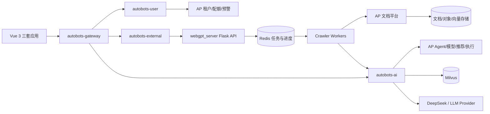
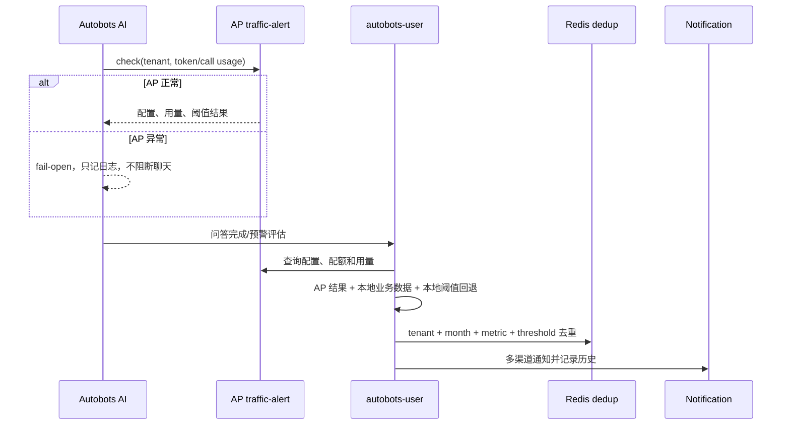
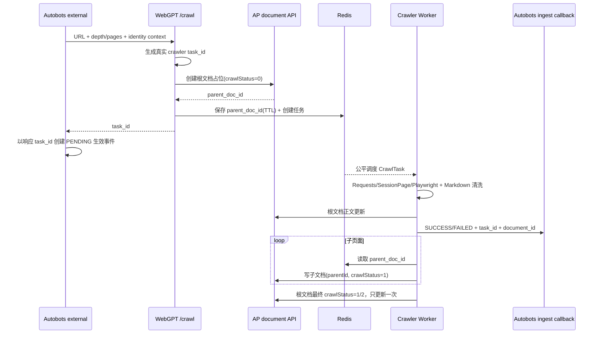
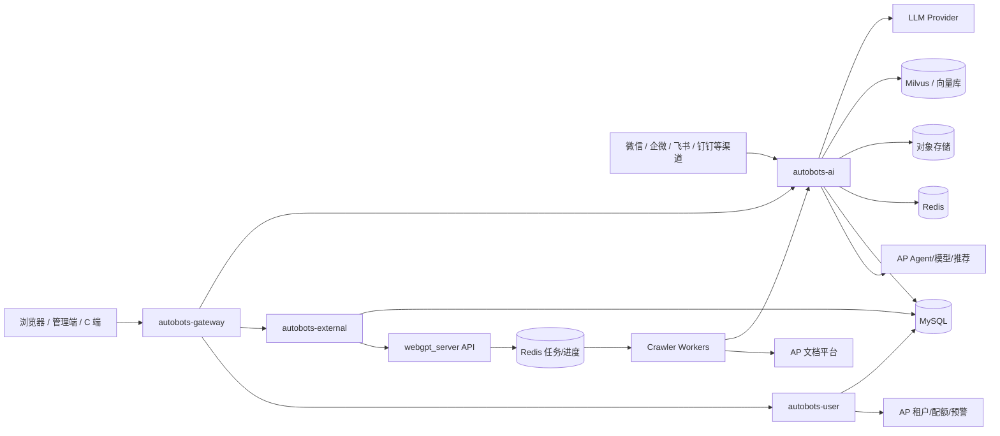
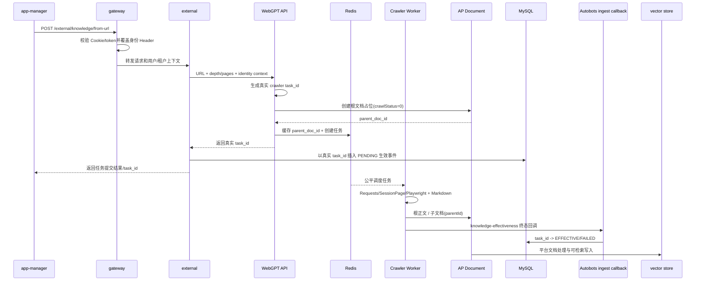
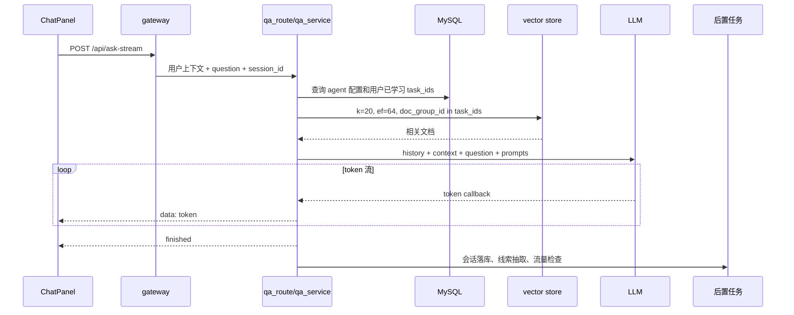
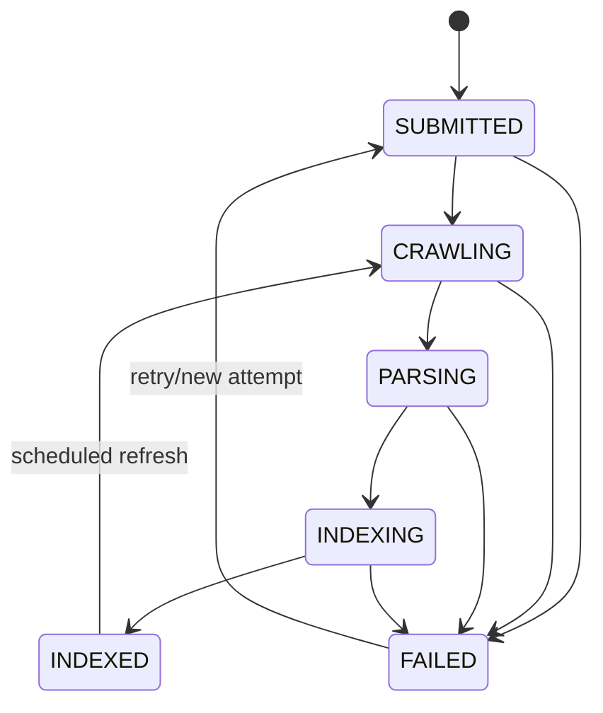

# Autobots 智能客服项目全栈面试技术文档

> 适用场景：前端岗位转全栈面试。本文以“我参与/负责智能客服系统中的知识库、网页爬取、AI 问答和管理端能力”为叙述主线，重点帮助面试时讲清楚端到端链路、后端设计、前端协作、数据流和工程化取舍。

> 文档依据：`PROJECT_NAVIGATOR.md` 的 `autobots` 与 `agplateform` 部分，以及 Autobots 主仓库、`../agplateform`、`../webgpt_server` 的相关前端、Java、Python、SQL 和测试代码。最后核对日期：2026-08-10。

## 0. 使用方法与面试速记

这不是一份需要逐字背诵的稿子。正确使用方式是：先完成个人信息校准，再记住一条主链路、三个项目故事和一套回答结构，最后用题库查漏补缺。

阅读导航：

- 面试只剩 30 分钟：看第 0、18、19、35 节。
- 面试只剩 1 天：再看第 20、25、29、31 节。
- 有 3-7 天准备：按第 34 节计划完整复习。
- 面试偏前端：重点看第 21、24、29 节。
- 面试偏 Java/Python 后端：重点看第 22、23、25-28 节。
- 面试偏 AI 应用/RAG：重点看第 20、24、26-30 节。

### 0.1 四种内容标签

面试前请给自己讲到的内容做真实性分级：

| 标签 | 含义 | 面试表达 |
| --- | --- | --- |
| `[主导]` | 你负责方案并完成主要实现 | “我负责……，我当时的设计是……” |
| `[参与]` | 你承担其中明确的一部分 | “我参与了……，主要负责……” |
| `[AI辅助]` | 代码主要由 AI 生成，你负责需求拆解、方案判断、审查、联调和验证 | “这部分使用 AI 辅助实现，我能解释并对交付结果负责……” |
| `[掌握]` | 不是你开发，但你读过代码并能解释 | “这部分不是我主导，我结合联调和源码了解了……” |
| `[建议]` | 当前未实现，是你基于现状提出的演进方案 | “当前实现是……，如果继续演进，我会……” |

以下内容中凡是出现“我负责”“我改造”“上线后提升”等措辞，都必须与真实经历一致。没有证据的内容不要包装成个人贡献。

### 0.2 面试前必须填写的个人校准卡

请在自己的复习副本中填写，正式面试时不要念占位符：

| 项目项 | 真实信息 |
| --- | --- |
| 项目周期 | `2025.08-2026.08` |
| 团队规模 | Autobots 执行团队 5 人：前端 1、Java 1、Python 1、测试 1、产品 1；另有 AP 项目统筹 2 人 |
| 你的正式岗位 | 前端工程师，团队中唯一前端 |
| 你直接负责的页面 | Autobots 全部前端应用和页面：`app`、`app-manager`、`app-admin`，以及前端构建发布相关工作 |
| 你直接开发的 Java 类/接口 | 后端代码主要使用 AI 辅助生成；按 `[AI辅助]` 表述，不包装成长期纯手写 Java 经验 |
| 你直接开发的 Python 模块 | AI 服务代码主要使用 AI 辅助生成；按 `[AI辅助]` 表述，重点证明能解释、联调、验证和排障 |
| 你推动的技术决策 | 优化前端生产打包：Arco 组件库改为预构建产物复用，并用源码 hash 清单校验产物一致性 |
| 你解决的线上问题 | 解决线索管理中产品与人员关联问题；具体故障表现、实现动作和结果仍需补充为 STAR |
| 可公开的规模指标 | 当前用户约 8 个；知识量、调用量和并发量暂未形成可靠统计口径 |
| 可公开的效果指标 | 暂无可核验的耗时、错误率、成功率或人工成本数据；主问答模型使用 DeepSeek，但模型选型不是效果指标 |

### 0.3 五分钟速记卡

项目一句话：

> Autobots 是一个企业智能客服平台，使用 Vue 3 管理端承接智能体和知识库配置，Java Spring Boot 服务负责网关、账号和外部系统适配，Python FastAPI 服务负责文档摄入、RAG 流式问答、会话和线索能力。

只记一条主链路：

```text
URL 导入
  -> gateway 鉴权并注入用户/租户上下文
  -> external 生成 task_id 并启动爬虫
  -> 爬虫产出内容
  -> ingest 解析 chunk 并写入向量库
  -> 文档状态变为可检索
  -> QA 按服务端计算出的 task_ids 过滤召回
  -> LLM 生成并通过 POST + 流式响应返回
  -> 会话落库、线索抽取和流量预警等后置动作
```

只记三个项目故事：

| 故事 | 要证明的能力 | 一句话结论 |
| --- | --- | --- |
| 前端生产构建优化 | 真实工程决策、发布稳定性 | Arco 预构建复用 + 源码 hash 校验，日常发版不再重复重建组件库 |
| 线索管理产品与人员关联 | 业务建模、线上问题处理 | `【需补充具体故障、方案和结果后再用于面试】` |
| 知识摄入与 RAG 问答 | 跨栈理解、异步任务 | 能从前端状态追到 Java/Python、数据库和向量检索，但后端按 AI 辅助经验表述 |

回答任何技术问题都使用这套结构：

```text
背景 -> 约束 -> 当前方案 -> 为什么这样做 -> 风险/不足 -> 演进方案
```

例如面试官问“为什么用异步任务”，不要只回答“因为耗时长”，而应回答：

> 网页爬取、对象存储、文档解析和向量写入的耗时及失败点都不可控，这是背景；接口不能长期占用连接并受网关超时限制，这是约束；当前方案是先创建任务并返回关联 ID，后台处理并更新状态；这样能分离提交成功和最终生效，但会引入最终一致性、重试和幂等问题；进一步可以使用可靠消息、显式状态机和补偿任务。

### 0.4 面试表达红线

1. `task_id` 是关联键，不是单独的权限边界。
2. “代码中存在”不等于“我实现了”，个人贡献必须单独说明。
3. “可以统计 P95”不等于“已经取得 P95 优化结果”。
4. 不要把单机内存调度描述成完善的分布式任务系统。
5. 不要笼统说“用了微服务所以性能高”；服务拆分首先解决职责、独立演进和故障边界问题。
6. 不要说“用了向量库就不会产生幻觉”；RAG 只能提供证据，仍需要检索评测、Prompt 约束和拒答策略。
7. 不要说“使用 SSE 就会自动重连”。本项目前端是 `fetch` 消费 POST 流，需要自己处理取消、异常和重试。
8. 不编造 QPS、并发、准确率或业务收益；没有数字时说清验证方法和下一步如何测量。

### 0.5 建议准备的真实数字

至少准备三项能够解释采集方法的真实指标：

| 指标 | 统计口径 | 可回答的追问 |
| --- | --- | --- |
| 知识生效时间 | `effective_at - submitted_at` | 为什么看 P50/P95，而不只看平均值 |
| 首 Token 时间 | 收到请求到第一个有效 token | 检索、模型排队、网络分别影响什么 |
| 完整回答时间 | 请求开始到流结束 | 为什么首 Token 快不代表总耗时低 |
| 入库成功率 | 成功任务数 / 提交任务数 | 失败集中在哪个阶段，如何重试 |
| RAG 命中率 | 测试问题中召回正确证据的比例 | 如何构建评测集和标注 |
| 拒答准确率 | 应拒答和不应拒答的分类结果 | 如何平衡安全与可用性 |

没有生产指标时，可以如实说：“项目已经记录了首 Token、总耗时或生效事件，我会先统一口径，再从日志/事件表建立基线；目前不能给出未经验证的数字。”

## 1. 项目一句话介绍

Autobots 是一个面向企业的智能客服平台，提供用户认证、智能体配置、知识库管理、网页知识爬取、文档解析、RAG 问答、多渠道机器人接入、线索抽取与线索推送、运营日报和流量预警等能力。

如果面试官让快速介绍，可以这样讲：

> 这个项目是一个企业智能客服平台，前端是 Vue 3 + TypeScript 的多应用工作台，后端由 Java Spring Boot 微服务和 Python FastAPI AI 服务组成。我是团队中唯一前端，负责 `app`、`app-manager`、`app-admin` 全部前端应用和生产构建发布；同时通过 AI 辅助方式参与 Java/Python 跨栈需求，重点承担需求拆解、接口联调、结果验证和问题定位。后端部分按实际可解释深度表述，不包装成长期纯手写经验。

## 2. 技术栈与模块分工

### 2.1 Java 微服务

| 模块 | 端口 | 责任 |
| --- | --- | --- |
| `autobots-gateway` | 8080 | API 网关、统一入口、JWT/Cookie 鉴权、CORS、请求转发 |
| `autobots-user` | 8081 | 登录注册、邀请码、线索推送、运营日报、流量预警配置 |
| `autobots-external` | 8082 | 外部集成、知识库管理、文档上传、网页 URL 爬取入口 |
| `autobots-dao` | - | MyBatis-Plus 实体和 Mapper |
| `autobots-common` | - | 通用响应、异常、JWT、工具类 |

### 2.2 Python AI 服务

| 模块 | 端口 | 责任 |
| --- | --- | --- |
| `autobots-ai` | 8083 | FastAPI、LangChain、Milvus 检索、问答、文档摄入、多渠道回调、线索抽取 |

当前主问答链路通过 `loadmodel_deepseek()` 加载 DeepSeek 模型；代码中也初始化了 Qwen Flash 相关客户端。面试时可以说“主问答模型使用 DeepSeek”，不要在没有配置和调用证据时扩展到具体未核实的模型版本或所有链路。

核心目录：

| 目录 | 说明 |
| --- | --- |
| `server/*_route.py` | FastAPI 路由层 |
| `services/*_service.py` | 业务编排层 |
| `repositories/*_repository.py` | 数据访问层 |
| `ai/` | LLM、Embedding、Retriever、Reranker、Memory、Rewriter、Summarizer |
| `dao/` | Milvus / 向量库 / 数据库访问 |

### 2.3 前端

| 子应用 | 责任 |
| --- | --- |
| `autobots-frontend/app` | C 端聊天、登录、首页聊天体验 |
| `autobots-frontend/app-manager` | 企业管理端，包含智能体、知识库、对话历史、线索、数据看板、运营日报 |
| `autobots-frontend/app-admin` | 平台管理端，包含用户、企业、合同、内部数据看板 |

技术栈：Vue 3.5、TypeScript、Vite、Pinia、Vue Router、Arco Design Vue、Axios、ECharts、pnpm workspace。

## 3. 总体架构

```text
浏览器 / SDK / 第三方渠道
        |
        v
autobots-gateway
  - Cookie / JWT 鉴权
  - 注入 X-User-Id / X-Tenant-Id 等上下文
  - 按路径路由到下游服务
        |
        +--> autobots-user
        |      - 用户、线索、日报、流量预警
        |
        +--> autobots-external
        |      - 知识库、文件上传、URL 爬取入口
        |
        +--> autobots-ai
               - 文档摄入、向量检索、流式问答、渠道机器人

底层依赖：
MySQL / Redis / Milvus / 对象存储 / LLM Provider / 外部爬虫服务 / Agentic Platform
```

### 面试讲法

这个架构的关键不是“有几个服务”，而是职责拆分：

1. `gateway` 处理统一认证和路由，避免每个业务服务重复处理 Cookie/JWT。
2. `user` 承接账号、运营和推送类业务，是传统 Java 业务服务。
3. `external` 作为外部知识服务的适配层，隔离爬虫、文件、知识 Store 等上游接口差异。
4. `ai` 承接高变化的 AI 能力，用 Python 生态快速集成 LangChain、Milvus、Embedding、Rerank、ASR/TTS 和渠道机器人。
5. 前端管理端通过 API 层封装接口，页面只关注交互状态和业务视图。

## 3A. 跨项目架构：agplateform、AP 与 webgpt_server

此前只把 Agentic Platform 和爬虫画成“外部依赖”是不够的。当前真实链路至少包含三个边界清晰的系统：

| 系统 | 架构角色 | 主要责任 | 数据所有权 |
| --- | --- | --- | --- |
| `../agplateform`（AP） | 平台控制面 | 租户、Agent、模型供应商、文档、配额、流量预警、平台观测 | 平台配置、租户配额和平台用量的真相源 |
| Autobots | 智能客服业务面 | 三套前端、用户、知识编排、RAG、会话、线索、渠道和日报 | 客服业务数据、会话、线索和本地运营指标 |
| `../webgpt_server` | 网页抓取执行面 | URL 校验、Redis 任务、抓取策略、链接发现、父子文档推送 | 短期任务状态和抓取执行上下文 |

这种拆分不是为了增加服务数量，而是隔离三种不同负载：企业业务强调事务和权限；AI 在线问答受模型延迟和配额影响；爬虫面对不可信网络、浏览器资源和反爬策略。拆分后可以独立限流、扩容和发布，但要额外治理内部认证、租户上下文、契约、超时、状态同步和链路追踪。

### 3A.1 完整拓扑



### 3A.2 AP 的平台能力

当前源码快照里，AP 使用 Java 21 / Spring Boot 3.5 的核心服务、React 18 + TypeScript 管理前端，以及 Go 编排和 Rust 运行时。面试不需要把所有语言说成个人技能，重点是解释 Autobots 为什么依赖 AP：

| 能力 | 关键调用或入口 | 设计重点 |
| --- | --- | --- |
| 租户配额 | `/internal/tenant/{tenantId}/quotas` GET/PUT | AP 为真相源；`-1` 表示无限 |
| 配额账本 | `/internal/tenant/{tenantId}/quota-ledger` POST | 充值/退款必须按业务单号幂等 |
| Agent 生命周期 | Agent list/get/create/update/delete/deprecate/publish | Autobots 页面映射 AP 的平台配置 |
| 模型列表 | `/api/v1/mcp/llm-providers/models/unified` | DeepSeek `sourceId` 动态获取，不硬编码记录 ID |
| 推荐问题 | `/api/v1/agents/{agentId}/recommendations` | 推荐失败可降级为空，不阻断主问答 |
| 流量预警 | `/internal/traffic-alert/*` | 配置、用量、检查、历史和测试分开 |
| 预警管理 | `/v1/observe/traffic-alert/config` 等 | 管理接口有会话和 `admin:traffic-alert:manage` 权限 |

Autobots 的 Python `agentic_platform_client.py` 还封装了 Agent 执行/预览流、Prompt 润色、API Key 和知识库删除等能力。它是跨系统防腐层：统一 URL、鉴权、超时、响应归一化和异常降级，业务 Route 不应散落 AP 具体路径。

### 3A.3 配额和流量预警的数据归属

三个字段最容易在面试中被追问：

```text
monthlyTokens         = 当前月 Token 上限
monthlyApiCalls       = 当前月对话调用/轮次上限
maxConversationTurns  = 单个会话允许的最大轮次
```

它们不是同一个时间窗口。日报中的会话数、独立 IP、平均轮次、消息、首 Token、线索和热点主题由 Autobots 计算；配额和平台流量用量来自 AP。Autobots 可以读取、合并和展示，但不能构造一个本地值覆盖 AP 真相。



`fail-open` 只适合流量预警这类旁路。认证、租户授权、配额扣减或跨租户检索必须 `fail-closed`，否则可用性会变成安全漏洞。

### 3A.4 WebGPT API 与 Redis 任务模型

WebGPT 使用 Flask 暴露三个核心接口：

| 接口 | 当前语义 | 关键风险 |
| --- | --- | --- |
| `POST /crawl` | 校验 URL，生成 UUID `task_id`，创建根文档占位并入队 | 返回成功仅表示接收任务 |
| `GET /status/{task_id}` | 从 Redis 读取 total/completed/failed/running | Redis 缺失目前会被当作 completed，语义不完整 |
| `POST /cancel/{task_id}` | 清理队列和任务状态 | 不能保证正在执行的网络/浏览器请求立刻停止 |

`CrawlTask` 保存 `task_id`、URL、depth/maxDepth/maxPages、allowed domains、父任务、入口 ID、状态、Worker、重试、错误和调用 AP 的凭证上下文。状态包括 `pending/running/completed/failed/cancelled`。

Redis 不只是一个 List：

1. Hash 保存任务元数据和 total/completed/failed/running 进度。
2. 每个 `task_id` 有优先队列，全局用轮询游标做近似公平调度，避免一个大任务长期占满 Worker。
3. Worker 支持批量预取和本地 buffer，减少 Redis 往返，但宕机时要考虑已预取任务如何恢复。
4. 每个任务维护 canonical URL visited set，并设置 TTL，防止环形链接和重复页面无限扩张。
5. `parent_doc_id` 和根任务终态更新标志也在 Redis 中保存，因此 Redis 的持久化和过期策略会影响父子关系与状态可靠性。

### 3A.5 抓取策略为什么不是只用 Playwright

当前 Worker 先用 Requests。静态结果链接足够多时直接使用；链接较少时并行比较 Requests、SessionPage 和 Playwright，再按链接数量和可用内容选择策略，并缓存选择结果。

| 策略 | 资源成本 | 能力 | 使用建议 |
| --- | --- | --- | --- |
| Requests | 低 | 静态 HTML | 默认首选，设置连接/读取超时和响应大小限制 |
| SessionPage | 中 | 会话和部分动态场景 | 复用会话，限制 Cookie 和域名范围 |
| Playwright | 高 | 执行 JavaScript、读取动态 DOM | 使用浏览器池/Context，阻断图片等非必要资源 |

这是按证据逐级增加成本的策略。继续演进时要观测每种策略的成功率、单页耗时、内存、域名分布和切换原因，而不是用“动态页面更强”作为无条件上浏览器的理由。

### 3A.6 父子文档与知识生效回调



先创建根文档占位是为了解决子页面先完成、却拿不到 `parentId` 的竞态。它仍有失败边界：占位创建失败、TTL 到期、根正文更新失败、子页等待超时和孤儿文档都要可观测。

知识生效跟踪必须使用 WebGPT 实际返回的 crawler `task_id`，而不是只使用 Autobots 发请求前的候选 ID。根文档推送成功/失败后，WebGPT 回调 `autobots-ai/server/ingest_route.py` 的 `/knowledge-effectiveness`；若 pending 记录暂时不可见，`409` 表示可重试的状态竞态。当前有限重试仍可能丢失终态，可靠方案是 Outbox、持久化重试或 DLQ，加消费者幂等和补偿扫描。

### 3A.7 WebGPT 安全与稳定性追问

1. **SSRF：** 协议和 allowed domains 不够；DNS 解析与每跳重定向后都要拒绝私网、loopback、link-local 和 metadata IP。
2. **凭证：** 不应把可复用原始 Token 长期保存在 Redis；使用短期、最小权限的凭证引用并对日志脱敏。
3. **TLS：** 生产环境不能默认关闭证书校验；应使用可信 CA 和受控出网代理。
4. **伪成功：** Redis 状态缺失可能来自完成、过期、取消、故障或丢失，终态应落持久化任务表。
5. **取消：** 清理未执行任务之外，运行中的 Worker 还要协作检查取消标志并终止 HTTP/浏览器操作。
6. **浏览器资源：** Playwright 应使用并发上限、浏览器池、页面超时和资源阻断，防止一个站点拖垮 Worker。
7. **回调：** 失败不阻断爬虫是合理降级，但必须有持久化补偿，否则知识效果指标会永久不一致。

### 3A.8 个人贡献边界

> AP 和 WebGPT 是关联项目，不是我个人从零实现。我作为 Autobots 唯一前端，在页面、接口和跨系统联调中接触这些能力；Java/Python 主要使用 AI 辅助。我能沿真实源码解释数据归属、任务状态、父子文档、回调幂等、失败降级和测试方案，但不会把平台架构包装成个人主导成果。

## 4. 核心业务链路一：网页知识爬取

### 4.1 用户视角

企业用户在管理端进入知识库页面，点击“网页导入”，输入 URL，可以选择定时刷新规则。系统启动解析任务，后续在知识列表中看到解析进度、状态、子网页和生效结果。

### 4.2 前端入口

相关文件：

| 文件 | 职责 |
| --- | --- |
| `app-manager/src/views/Knowledge/Content/Add/UrlUploadModal.vue` | URL 导入弹窗 |
| `app-manager/src/api/knowledge2.ts` | 知识库 API 封装 |
| `app-manager/src/views/Knowledge/Content/index.vue` | 知识列表、状态展示、刷新配置入口 |
| `app-manager/src/views/Knowledge/Content/ScheduleSettingsModal.vue` | 网页知识定时刷新配置 |

前端 API：

```ts
export function importFromUrl(data: WebImportRequest) {
    return request.post<KnowledgeDocumentVO>('/external/knowledge/from-url', data)
}

export function updateKnowledgeRefreshSchedule(docId: number, data: WebRefreshSchedule) {
    return request.put<null>(`/external/knowledge/documents/${docId}/refresh-schedule`, data)
}

export function getDocChildren(docId: number, params?: DocChildrenReq) {
    return request.get<PageData<KnowledgeDocumentVO>>(
        `/external/knowledge/documents/${docId}/children`,
        { params }
    )
}
```

### 4.3 Java 后端入口

Controller：

```java
POST /external/knowledge/from-url
PUT  /external/knowledge/documents/{docId}/refresh-schedule
GET  /external/knowledge/documents/{docId}/children
```

对应文件：

| 文件 | 职责 |
| --- | --- |
| `autobots-external/.../controller/KnowledgeController.java` | 暴露网页导入、子网页查询、定时刷新配置接口 |
| `autobots-external/.../service/impl/KnowledgeServiceImpl.java` | 构造爬虫请求、透传鉴权、处理返回、创建生效时延事件 |
| `autobots-external/.../service/KnowledgeEffectivenessTracker.java` | 记录知识从提交到可检索的生效时延 |
| `autobots-external/.../service/impl/InMemoryKnowledgeRefreshScheduler.java` | 网页知识定时刷新任务调度 |

### 4.4 请求数据处理

`KnowledgeServiceImpl.fromUrl` 的核心流程：

1. 生成或使用前端传入的候选 `taskId`，用于构造请求；它不一定是最终执行标识。
2. 从网关注入的请求头里获取 `X-Tenant-Id`，用于租户隔离和指标归属。
3. 构造爬虫 payload：
   - `url`
   - `user_id`
   - `knowledgebase_id`
   - `task_id`
   - `max_depth`
   - `max_pages`
   - `refresh_schedule`
4. 将 Authorization 和 Cookie token 透传给爬虫服务。
5. 调用外部爬虫服务。
6. 将爬虫响应转换成统一 `ApiResponse`。
7. 从 WebGPT 响应的 `taskId/task_id` 提取真实 crawler `task_id`，回写请求上下文。
8. 如果启动成功，以真实 crawler `task_id` 记录 `PENDING` 生效事件；如果启动失败，记录 `FAILED`。

WebGPT 接收后还会：

1. 规范化 URL 和 allowed domains，生成 UUID `task_id`。
2. 在 AP 文档接口创建根文档占位，把 `parent_doc_id` 放入 Redis，TTL 为 24 小时。
3. 创建 Redis 任务元数据、visited set 和任务优先队列。
4. Worker 先用 Requests；结果不足时比较 SessionPage 和 Playwright。
5. 根页面补齐占位正文，子页面携带 `parentId` 写入 AP。
6. 根文档成功或失败后回调 Autobots AI 的 knowledge-effectiveness 接口。

### 4.5 为什么需要 `task_id`

`task_id` 是网页爬取、文档记录、知识生效事件、向量库检索和问答召回之间的关联键。这里必须采用 WebGPT 返回的真实 crawler `task_id`；AP 的 `document_id` 是文档资源标识和父子关系主键，两者不能混用。

面试时可以这样讲：

> URL 爬取是异步链路，前端不应该同步等待所有网页解析和向量入库完成。每次任务使用 `task_id` 贯穿爬虫、文档表、向量库 metadata 和生效事件。问答时，服务端先根据可信身份和数据归属计算允许访问的 `task_id`，再用它过滤 `doc_group_id`。因此，`task_id` 负责分组和关联，真正的权限边界由网关身份、数据库授权关系和服务端检索过滤共同构成。

### 4.6 生效时延跟踪

项目里有 `KnowledgeEffectivenessTracker`，用来记录“提交知识”到“知识可检索/发布成功”的耗时。

两类知识更新方式：

1. 文件、问答对等同步能拿到 `documentId` 的更新：通过轮询文档详情状态，直到 `indexed` 或 `failed`。
2. 网页爬虫：WebGPT 接收任务后返回真实 `task_id`，external 以它写入 pending 事件；根文档推送成功或失败后，由 `autobots-ai/server/ingest_route.py` 的 `/knowledge-effectiveness` 接收终态回调。

这个设计的价值：

1. 前端能展示“提交成功”和“最终生效”两个不同状态。
2. 数据看板能统计知识更新生效时延，例如 P50/P95。
3. 爬虫和向量入库是异步的，指标不能靠接口耗时替代。

当前还存在一个很适合面试展开的竞态：极小页面可能在 pending 事件可见前就完成回调。回调找不到事件时返回 `409`，WebGPT 做有限重试。更完整的方案是任务事件先持久化再发布、状态按 `task_id` 幂等 upsert，或者用 Outbox 保证任务与事件最终一致。

### 4.7 定时刷新

网页知识可以保存刷新计划，支持：

| 字段 | 含义 |
| --- | --- |
| `scheduleEnabled` | 是否开启 |
| `scheduleType` | `daily` / `weekly` / `monthly` / `cron` |
| `scheduleTime` | 执行时间 |
| `scheduleWeekday` | 周几 |
| `scheduleMonthDay` | 每月几号 |
| `cronExpression` | 自定义 cron |
| `retryOnFailure` | 失败是否重试 |
| `retryTimes` | 重试次数 |

服务重启后通过 `restoreEnabled` 恢复已启用的任务。

## 5. 核心业务链路二：文档摄入与向量入库

### 5.1 文档上传链路

文档上传入口在 `autobots-ai/server/document_route.py` 的 `/document/upload`，业务编排在 `services/document_service.py`。

典型流程：

1. 认证用户。
2. 生成 `task_id`、`entry_id`、`log_id`。
3. 先写入 `user_crawl_urls`，状态为处理中。
4. 文件写入对象存储。
5. 后台解析文档，生成 chunk。
6. 写入 `distributed_crawler_data`。
7. 调用向量库 upsert，metadata 中写入 `doc_group_id = task_id`。
8. 成功后更新 `user_crawl_urls.status = 1`，失败则更新失败状态。

### 5.2 网页内容摄入链路

网页爬虫会产生 HTML/Markdown 内容，再通过 `autobots-ai/server/ingest_route.py` 入库。

`/ingest` 的核心流程：

1. 根据 `data_id` 查询 `task_id`、`entry_id`、`source_url`、`depth`、`title`。
2. 从对象存储读取文件。
3. 解析文档为 section/chunk。
4. 给 chunk 追加 metadata：
   - `doc_group_id`
   - `source_url`
   - `data_id`
   - `data_version`
   - `level`
5. 写入向量库。
6. 标记知识生效事件成功。

### 5.3 为什么先落库再异步解析

面试回答：

> 文档解析和向量入库耗时不可控，尤其 PDF、网页和大文件处理会受到文件大小、网络和模型服务影响。如果接口同步等待，用户体验会很差，也容易被网关超时打断。项目采用先创建任务记录、立即返回，再异步处理状态的方式；前端基于列表轮询或刷新展示 `pending`、`processing`、`indexed`、`failed`。如果这是你参与的设计，再补充自己的具体动作和结果。

## 6. 核心业务链路三：RAG 流式问答

### 6.1 前端聊天入口

C 端聊天在 `autobots-frontend/app`：

| 文件 | 职责 |
| --- | --- |
| `app/src/components/Chat/ChatPanel.vue` | 聊天主面板 |
| `app/src/components/Chat/ChatInput.vue` | 输入区 |
| `app/src/components/Chat/ChatContent.vue` | 消息内容 |
| `app/src/api/chat.ts` | 聊天 API |

管理端也有聊天和预览能力：

| 文件 | 职责 |
| --- | --- |
| `app-manager/src/views/Chat/index.vue` | 管理端聊天 |
| `app-manager/src/views/ChatHistory/index.vue` | 对话历史 |
| `app-manager/src/views/App/` | 智能体创建、配置、预览 |

### 6.2 Python 问答入口

| 文件 | 职责 |
| --- | --- |
| `autobots-ai/server/qa_route.py` | 问答路由、SSE/流式响应、多模态输入、会话上下文 |
| `autobots-ai/services/qa_service.py` | 问答业务包装，读取智能体配置、知识 task_id、组织 prompt |
| `autobots-ai/services/facade_service.py` | RAG 编排门面 |
| `autobots-ai/repositories/document_repository.py` | 查询用户可用知识 task_id |

### 6.3 问答主流程

1. 前端带 `app_key`、`question`、`session_id` 发起流式问答请求。
2. `qa_route.py` 解析参数、处理图片/附件/语音等输入，并拿到用户、租户、来源 IP。
3. `QAServiceWrapper.ask_question_stream` 校验参数。
4. 根据 `app_key` 查询智能体配置：
   - 智能体类型
   - 角色设定 `roleSetting`
   - 安全提示词 `safetySystemPrompt`
   - 渠道类型特殊限制，例如公众号回答字数限制
5. 根据 `app_key + user_id` 查询用户已发布知识的 `task_id` 列表。
6. 如果存在问答对知识，追加 `${user_id}_qa_pairs` 作为 QA task。
7. 调用 RAG 门面检索知识并生成答案。
8. 通过 SSE/StreamingResponse 返回 token 流。
9. 回答结束后记录会话、触发线索抽取、流量预警检查等后置动作。

### 6.4 RAG 检索范围控制

向量库中每个 chunk 的 metadata 会带 `doc_group_id`。问答时通过用户可访问的 `task_id` 列表过滤检索范围。

这个点适合面试重点讲：

> RAG 系统最重要的不是“能检索”，而是“检索范围正确”。系统用 `task_id` 作为知识分组，写入向量 metadata 的 `doc_group_id`。问答时由服务端根据当前用户查询已学习知识，再把允许的 `task_ids` 传给 retriever 过滤，不能接受前端直接指定任意检索范围。当前仓储查询主要做到用户级隔离；如果业务要求同一用户的不同智能体只访问各自绑定的知识库，还需要通过智能体-知识库关联表做更细粒度过滤，不能只检查 `app_key` 是否存在。

## 7. 核心业务链路四：线索抽取与业务闭环

智能客服不只回答问题，还要把潜在客户沉淀成线索。

相关模块：

| 模块 | 文件 |
| --- | --- |
| 线索 API | `autobots-ai/server/lead_route.py` |
| 线索服务 | `autobots-ai/services/lead_service.py` |
| 线索表单 | `autobots-ai/services/lead_form_service.py` |
| 线索抽取池 | `autobots-ai/services/lead_extractor_pool.py` |
| 线索推送客户端 | `autobots-ai/services/lead_push_client.py` |
| Java 线索推送 | `autobots-user/.../LeadPushController` |
| 前端线索管理 | `app-manager/src/views/LeadsManagement/` |

可以这样讲：

> 问答结束后，系统会基于对话内容做线索抽取，比如姓名、手机号、需求、预约信息等。抽取出来的数据进入线索管理页，企业可以配置 Webhook 推送到 CRM。这里我关注的是两个闭环：一是 AI 对话到业务线索的闭环，二是推送成功率、失败原因和重试状态的可观测闭环。

## 8. 网关与鉴权

### 8.1 鉴权流程

1. 用户登录后，后端把 token 写入 httpOnly Cookie。
2. 后续请求进入 `autobots-gateway`。
3. Gateway AuthFilter 从 Cookie 中读取 token。
4. 调用认证服务或统一认证接口校验 token。
5. 校验成功后，把用户上下文写入请求头转发给下游：
   - `X-User-Id`
   - `X-Username`
   - `X-Tenant-Id`
   - `X-User-Roles`

### 8.2 为什么下游从 Header 取用户上下文

面试回答：

> 网关统一解析 Cookie 并调用认证接口，校验成功后使用 `headers.set(...)` 覆盖 `X-User-Id`、`X-Tenant-Id` 等身份头。下游不需要重复解析 Cookie，但信任这些 Header 有两个前提：下游不能绕过网关直接暴露公网，敏感操作仍要校验用户与租户的数据归属。这样能集中认证，同时避免把“有一个 Header”误当成完整授权。

## 9. 数据模型与状态设计

### 9.1 知识状态

前端类型中知识状态包括：

| 状态 | 含义 |
| --- | --- |
| `pending` | 等待处理 |
| `processing` | 处理中 |
| `indexed` | 已索引，可检索 |
| `failed` | 处理失败 |

网页采集状态：

| 状态 | 含义 |
| --- | --- |
| `0` | 采集中 |
| `1` | 采集完成 |
| `2` | 采集失败 |

两套状态不能简单一一等价：采集完成只说明内容获取结束，只有解析并写入向量库后才是 `indexed`。建议面试时画出以下状态关系：

```text
提交成功
  -> pending
  -> processing / crawlStatus=0
  -> 爬取完成 / crawlStatus=1
  -> 文档解析和向量写入
  -> indexed

任一阶段不可恢复失败 -> failed / crawlStatus=2（按失败发生阶段记录原因）
```

状态源也要讲清：`user_crawl_urls.status` 表示学习结果，前端 `KnowStatus` 是展示契约，`knowledge_effectiveness_events.status` 用于衡量提交到可用的时延。它们服务于不同目的，不能只靠前端状态作为后端事实源。

### 9.2 关键数据表口径

| 表/实体 | 用途 |
| --- | --- |
| `user_crawl_urls` | 用户上传/爬取任务记录，保存 URL、标题、状态、task_id |
| `distributed_crawler_data` | 爬虫或文档解析后的内容明细 |
| `knowledge_effectiveness_events` | 知识更新生效时延事件 |
| `user_leads` | 用户线索 |
| `lead_push_execution` | 线索推送执行记录 |

### 9.3 状态设计原则

1. 用户提交成功不等于知识可检索。
2. 爬虫采集完成不等于向量入库完成。
3. 文档 `indexed` 后才应该进入问答召回范围。
4. 失败状态要保留失败原因，方便重试和排障。

## 10. 前端转全栈的个人亮点讲法

### 10.1 从前端视角切入

可以这样开场：

> 我之前主要做前端，所以最初关注的是网页导入后状态怎么展示、失败怎么重试、知识什么时候真正可问答。随着联调深入，我开始沿着接口继续追踪 Java 适配层、Python 摄入服务、数据库状态和向量检索，把一个页面状态理解成完整的后端任务模型。后端代码主要通过 AI 辅助生成，我的真实贡献是需求拆解、前后端契约、联调验证和问题定位，不描述成独立主导后端架构。

### 10.2 能体现全栈能力的点

| 能力 | 项目中的体现 |
| --- | --- |
| 接口设计 | 前端 API 类型、Java Controller、Python Route 对齐 |
| 异步任务 | URL 爬取、文档解析、向量入库、定时刷新 |
| 数据建模 | `task_id` 串联文档、向量、问答检索 |
| 后端集成 | Java 适配外部爬虫、Store、Agentic Platform |
| AI 工程 | RAG 检索、Prompt 注入、流式响应、知识隔离 |
| 可观测性 | 生效时延、失败原因、流量预警、日报指标 |
| 工程规范 | Java 三层、Python 三层、前端 Page/Component/API 分层 |

### 10.3 面试中建议主动讲的一个优化

`qa_service.py` 中保留了一段已注释的旧思路：用户问答时如果发现 URL 未解析，就在问答链路实时爬取。源码能说明系统曾考虑过这种方案，但除非你真实参与了改造，不要说成“我重构了”。它会带来几个问题：

1. 问答链路延迟不可控。
2. 爬虫失败会影响聊天体验。
3. 网页解析、入库和向量写入都不是实时任务。
4. 状态和失败原因难以前端可视化。

现在更合理的链路是：

```text
知识导入阶段：URL -> 爬虫 -> 文档解析 -> 向量入库 -> indexed
问答阶段：question -> 获取 task_id -> 向量检索 -> LLM 生成 -> SSE 返回
```

面试表达：

> 从设计上看，这个变化把知识摄入和在线问答解耦：知识摄入允许慢、可重试、可观测；在线问答要求快、稳定、尽快返回首 Token。两条链路通过 `task_id`、文档状态和向量 metadata 衔接。我的真实边界是通过前端联调和源码跟踪理解并验证该设计；后端改动属于 AI 辅助交付，不表述为我独立主导的架构重构。

## 11. 可展开讲的技术难点

### 11.1 异步任务一致性

问题：

> 用户提交 URL 后，爬虫服务、文档解析、对象存储、向量库写入是多个系统协作，中间任何一步失败都可能导致状态不一致。

解决思路：

1. 先创建任务记录，作为状态源。
2. 全链路传递 `task_id`。
3. 每个阶段更新状态和失败原因。
4. 问答只使用已发布或已索引的任务。
5. 对生效结果使用回调或轮询补偿。

### 11.2 RAG 知识隔离

问题：

> 向量库是共享基础设施，如何避免 A 企业召回 B 企业知识？

解决思路：

1. 数据库层按用户/租户/智能体查询可访问 `task_id`。
2. 向量 metadata 写入 `doc_group_id`。
3. 检索时用 `task_ids` 过滤。
4. 上层接口依赖网关注入的用户上下文，不接受前端随意传用户 ID。

### 11.3 流式响应与后置动作

问题：

> SSE 返回过程中，客户端可能提前断开，但系统仍要记录日志、触发流量预警或线索抽取。

解决思路：

1. 前端使用 `fetch` 发起 POST 请求，通过 `ReadableStream.getReader()` 读取并按 `\n\n` 切分事件，而不是浏览器原生 `EventSource`。
2. Python 使用 `StreamingResponse` 输出流；同步数据库操作通过 `asyncio.to_thread` 或 `run_in_threadpool` 避免阻塞 Uvicorn 事件循环。
3. RAG 内部由工作线程执行 LangChain 调用，回调收集 token，生成器持续输出；会话保存和线索抽取使用后台线程。
4. 流量预警检查由显式后台线程触发。该实现降低主响应阻塞，但进程内线程不具备可靠消息的持久化保证，服务崩溃时可能丢失后置任务。
5. 客户端断开后是否继续生成、如何取消模型调用、如何保证后置任务执行一次，仍需要显式的取消和幂等设计。

### 11.4 文件下载与跨域

项目中 `autobots-external` 提供外站文件代理下载：

```text
POST /external/knowledge/file-download
```

价值：

1. 前端不直接跨域拉外部文件。
2. 后端统一处理文件名、Content-Type、Content-Disposition。
3. 限制文件大小，避免大文件拖垮服务。

## 12. 常见面试问题与回答

### Q1：这个项目你最熟的是哪条链路？

答：

> 我最熟的是知识库到 AI 问答这条链路。前端管理端负责知识导入和状态展示；Java external 服务负责把文件、问答对、URL 导入适配到后端知识服务和爬虫；Python AI 服务负责文档解析、向量入库和 RAG 问答。这里有完整的全栈闭环：页面交互、接口设计、异步任务、数据库状态、向量检索和流式输出。

### Q2：为什么 Java 和 Python 都存在？

答：

> Java 更适合做稳定的业务服务，比如用户、权限、网关、线索推送、运营日报、外部系统适配。Python 更适合 AI 能力快速迭代，比如 LangChain、Embedding、Milvus、Rerank、ASR/TTS 和多渠道机器人。两者通过 HTTP 接口协作，边界比较清楚。

### Q3：网页爬取为什么不直接在前端等结果？

答：

> 爬虫和文档解析耗时不可控，可能涉及多页面、网络超时、反爬、对象存储和向量入库。如果前端同步等待，体验和稳定性都不好。更合理的是提交任务后立即返回 task_id，通过列表状态展示进度，失败时允许重试。

### Q4：如何保证问答只命中当前用户的知识？

答：

> 首先请求经过网关鉴权，网关覆盖用户和租户 Header；下游再根据 `user_id` 查询状态为已学习且未删除的知识 `task_id`，检索时过滤向量 metadata 中的 `doc_group_id`。所以不是前端传什么就查什么。需要注意，当前查询主要是用户级隔离；如果要求智能体级知识绑定，还应增加智能体与知识库关系条件。

### Q5：如果知识导入成功，但问答搜不到，怎么排查？

答：

> 我会按链路排查：第一看前端知识列表状态是否是 `indexed`；第二看 `user_crawl_urls` 是否有 task_id 且状态成功；第三看 `distributed_crawler_data` 是否有解析内容；第四看对象存储文件是否存在；第五看向量库 upsert 是否成功、metadata 的 `doc_group_id` 是否正确；第六看问答时传入 retriever 的 task_ids 是否包含这条知识。

### Q6：前端转全栈，你的优势是什么？

答：

> 我的优势是能从用户操作和业务状态倒推后端设计。比如知识导入页面上一个“处理中/失败/已索引”的状态，背后需要任务表、异步解析、失败原因、重试接口和检索范围控制。我不是只写接口，而是会关注这个接口最终怎么被用户理解、怎么排障、怎么形成业务闭环。

### Q7：这个项目有哪些可以继续优化的地方？

答：

> 第一，定时刷新目前如果是单机内存调度，后续可以迁到分布式调度或任务队列，避免多实例重复执行或重启丢失窗口。第二，爬虫和入库链路可以引入更明确的事件状态机，例如 submitted、crawling、parsed、indexed、failed。第三，RAG 召回可以继续做评测集、命中率、拒答准确率和证据引用质量监控。

## 13. 30 秒项目介绍模板

> Autobots 是一个企业智能客服平台，我是项目唯一前端，负责 `app`、`app-manager`、`app-admin` 全部前端应用，以及前端生产构建发布。项目使用 Vue 3 + TypeScript，后端是 Java Spring Boot 和 Python FastAPI。我最熟的真实工程优化是生产打包：把每次发版都重建 Arco 组件库，改成复用已提交的预构建产物，并用源码 hash 清单校验产物一致性，避免普通业务发版重复执行完整组件库构建。后端代码目前主要通过 AI 辅助完成，我重点掌握知识导入、`task_id`、向量入库和流式问答链路，并能进行接口联调、验证和排障。

## 14. 2 分钟项目介绍模板

> 这个项目是一个面向企业的智能客服系统，核心目标是让企业把自己的网页、文件和问答对变成客服机器人的知识来源，然后通过网页聊天、微信、企微、飞书、钉钉等渠道对外服务。
>
> 架构上分三层：前端是 Vue 3 + TypeScript 的 pnpm monorepo，有 C 端聊天、企业管理端和平台管理端；Java 后端包含 gateway、user、external、dao、common，其中 gateway 做统一鉴权和路由，user 做账号、线索、日报、流量预警，external 做知识库和爬虫相关外部接口适配；Python 的 autobots-ai 用 FastAPI 承接 AI 能力，包括文档摄入、向量检索、RAG 问答、线索抽取和多渠道回调。
>
> 我是项目唯一前端，负责三套前端应用和发布构建。以知识库和问答链路为例，用户在管理端导入 URL 后，前端调用 `/external/knowledge/from-url`，Java 服务生成 `task_id` 并调用爬虫，Python ingest 把内容解析成 chunk 后写入向量库；聊天时，QA 服务按用户已学习知识限制向量检索范围，再通过 POST 流式响应返回答案。我的主责是页面、交互、API 契约、流式消费和构建上线；Java/Python 改动使用 AI 辅助完成，我负责把业务需求转成可验证的改动并完成联调，不把这部分描述成传统纯手写后端年限。

## 15. 代码入口速查

### 网页爬取和知识库

| 场景 | 入口 |
| --- | --- |
| URL 导入弹窗 | `autobots-frontend/app-manager/src/views/Knowledge/Content/Add/UrlUploadModal.vue` |
| 知识 API | `autobots-frontend/app-manager/src/api/knowledge2.ts` |
| 知识 Controller | `autobots-external/src/main/java/com/br/autobots/external/controller/KnowledgeController.java` |
| 知识 Service | `autobots-external/src/main/java/com/br/autobots/external/service/impl/KnowledgeServiceImpl.java` |
| 生效时延 | `autobots-external/src/main/java/com/br/autobots/external/service/KnowledgeEffectivenessTracker.java` |
| 定时刷新 | `autobots-external/src/main/java/com/br/autobots/external/service/impl/InMemoryKnowledgeRefreshScheduler.java` |
| Python 文档爬取 | `autobots-ai/server/document_route.py` |
| Python 文档摄入 | `autobots-ai/server/ingest_route.py` |

### AI 问答

| 场景 | 入口 |
| --- | --- |
| 问答路由 | `autobots-ai/server/qa_route.py` |
| 问答服务 | `autobots-ai/services/qa_service.py` |
| RAG 门面 | `autobots-ai/services/facade_service.py` |
| 文档仓储 | `autobots-ai/repositories/document_repository.py` |
| C 端聊天组件 | `autobots-frontend/app/src/components/Chat/` |
| 管理端聊天历史 | `autobots-frontend/app-manager/src/views/ChatHistory/` |

### 线索与运营

| 场景 | 入口 |
| --- | --- |
| 线索路由 | `autobots-ai/server/lead_route.py` |
| 线索服务 | `autobots-ai/services/lead_service.py` |
| 线索表单 | `autobots-ai/services/lead_form_service.py` |
| 线索管理前端 | `autobots-frontend/app-manager/src/views/LeadsManagement/` |
| 运营日报前端 | `autobots-frontend/app-manager/src/views/DailyReport/` |
| 流量预警前端 | `autobots-frontend/app-manager/src/views/TrafficAlert/index.vue` |

### 前端构建与发布

| 场景 | 入口 |
| --- | --- |
| 根构建命令 | `autobots-frontend/package.json` |
| 生产 SRE 构建 | `autobots-frontend/scripts/build-sre.mjs` |
| Arco 预构建 | `autobots-frontend/scripts/build-arco.mjs` |
| 源码 hash 与产物校验 | `autobots-frontend/scripts/arco-build-utils.mjs` |
| 打包部署规则 | `autobots-frontend/docs/打包部署说明.md` |

## 16. 本地开发和验证口径

### Java

```bash
mvn -pl autobots-external -am test
mvn -pl autobots-user -am test
mvn -pl autobots-gateway -am test
```

### Python

```bash
cd autobots-ai
python -m pytest
python start.py
```

### 前端

```bash
cd autobots-frontend
pnpm -F app-manager lint
pnpm -F app-manager build
pnpm -F app lint
pnpm -F app build
pnpm build:sre
```

只有修改 Arco 组件库源码或相关构建脚本时，才执行 `pnpm build:arco`，随后再执行 `pnpm build:sre` 校验源码 hash 与预构建产物是否匹配。

### 配置说明

本地开发通过 profile 和环境变量注入配置，不在代码中硬编码敏感信息。常见变量只需要在文档或 `.env.example` 中表达变量名，例如：

```text
SPRING_PROFILES_ACTIVE
REDIS_HOST
REDIS_PORT
REDIS_PASSWORD
SPRING_DATASOURCE_URL
SPRING_DATASOURCE_USERNAME
SPRING_DATASOURCE_PASSWORD
JWT_SECRET
USER_SERVICE_URL
CONF_ENV
```

## 17. 面试前复习清单

1. 能画出 `gateway -> external -> crawler -> ai ingest -> vector db -> qa` 链路。
2. 能解释 `task_id` 为什么是核心关联键。
3. 能讲清楚 `pending / processing / indexed / failed` 状态区别。
4. 能讲清楚 SSE 流式问答和后置任务如何拆开。
5. 能讲清楚前端 API 类型如何和后端 DTO 对齐。
6. 能说出一个你做过或理解很深的优化：知识摄入和在线问答解耦。
7. 能说明如何排查“导入成功但问答搜不到”。
8. 能说明作为前端转全栈，为什么你理解用户体验、接口状态和后端任务模型之间的关系。

## 18. 个人贡献、简历和自我介绍

### 18.1 个人贡献矩阵

面试官真正判断的是“你做了什么”，不是“项目有什么”。建议把下表填写后放在自己的复习首页：

| 能力域 | 项目功能 | 你的级别 | 证据 | 能讲到的深度 |
| --- | --- | --- | --- | --- |
| 前端 | `app`、`app-manager`、`app-admin` 全部页面和交互 | `[主导]` | 页面、API、组件、测试、提交 | 组件拆分、状态、流式响应、异常、类型 |
| 前端工程 | 生产打包和上线构建 | `[主导]` | `build-sre.mjs`、`build-arco.mjs`、构建说明 | 预构建、hash 校验、环境 mode、发布可重复性 |
| Java | URL 导入适配、网关鉴权 | `[AI辅助]` | Controller/Service/Test 和联调结果 | 按能解释和验证的范围讲请求链、异常、身份传递 |
| Python | ingest、QA 流式输出 | `[AI辅助]` | Route/Service/Repo 和联调结果 | 按能解释和验证的范围讲 async、线程池、RAG |
| 数据库 | 任务表、生效事件、调度配置 | `[掌握]` | SQL、Mapper、状态排查 | 表关系、索引、幂等和最终一致性 |
| AI | DeepSeek、检索范围、Prompt、Memory | `[掌握]` | Facade/Retriever 和实际问答 | 召回、流式输出、幻觉、安全和评测思路 |

判断自己能否写“负责”的标准：能解释入口、核心代码、异常分支、测试方法、上线结果和一个不足。只能讲业务流程时，更适合写“参与联调”或“熟悉”。

### 18.2 简历项目描述模板

根据当前真实经历，推荐使用以下三条：

> 作为项目唯一前端，负责 Vue 3 + TypeScript 技术栈下 C 端聊天、企业管理端和平台管理端三套应用，覆盖智能体、知识库、对话、线索、数据看板、运营配置等模块及前端发布交付。

> 推动生产构建优化，将每次发版重复构建 Arco 组件库调整为预构建产物复用；通过 SHA-256 源码 hash 和构建清单校验产物一致性，使普通业务发版跳过整套组件库重建，并规范干净 k8s 容器中的构建流程。

> 使用 AI 编程辅助参与 Java/Python 跨栈需求，围绕网页知识摄入和 RAG 问答完成需求拆解、接口联调、测试验证与问题定位，理解 `task_id`、异步任务状态、向量检索过滤和 POST 流式响应等端到端链路。

当前不建议直接写“负责 Spring Boot/FastAPI 后端架构”或“主导 RAG 系统”，除非你能脱离 AI 解释核心实现、独立修改失败分支并完成测试。

简历结果暂时不要写百分比。当前有证据的结果是“普通业务发版不再重建 Arco”“源码和预构建产物可以自动校验”“三套前端由一人统一交付”。后续从 CI 日志补出构建耗时基线后，再增加量化结果：

> 将生产构建从每次重建 Arco 调整为预构建复用，使构建耗时从 `【旧 CI 真实数据】` 降至 `【新 CI 真实数据】`，下降 `【计算后填写】`。

### 18.3 30 秒自我介绍

> 我在 Autobots 项目担任唯一前端，负责 Vue 3 + TypeScript 的 C 端聊天、企业管理端、平台管理端以及前端发布构建。除了全部页面交付，我推动过生产打包优化，用 Arco 预构建产物和源码 hash 校验避免日常发版重复构建组件库。为了转向全栈，我也通过 AI 辅助参与 Java/Python 需求，能够沿知识导入和 RAG 问答链路完成接口联调、验证和排障，但会如实区分前端主导经验与 AI 辅助的后端经验。

### 18.4 2 分钟自我介绍结构

不要背成长段，记四段结构：

1. 过去：前端经验和最擅长的技术。
2. 转变：在哪个需求中开始承担接口、数据和后端问题。
3. 证据：讲一个端到端案例和一个可量化结果。
4. 目标：为什么应聘全栈，以及你能立即贡献什么。

示例：

> 我从 2025 年 8 月开始参与 Autobots 项目，正式岗位是前端，也是团队中唯一前端。我负责 C 端聊天、企业管理端、平台管理端三套应用，业务范围覆盖智能体、知识库、线索、数据看板和运营配置。团队执行角色包括前端、Java、Python、测试和产品各 1 人，另有 2 人负责 AP 项目统筹。
>
> 我有一个比较完整的工程优化案例。线上构建在干净 k8s 容器执行，原来的 `build:sre` 每次发版都会重建整套 Arco 组件库，构建慢且容易出现源码和产物不一致。我推动把 Arco 改成预构建产物：只有组件库源码变化时才执行 `build:arco`，日常发版直接复用仓库产物；同时计算源码 SHA-256，写入 `.build-manifest.json`，`build:sre` 会先校验产物是否完整、hash 是否匹配，再构建 SDK 和管理端。这个方案减少了重复构建步骤，也让发布规则可检查，而不是依赖人工记忆。准确耗时提升还需要从 CI 历史补充，我不会编造百分比。
>
> 在后端方面，当前 Java/Python 代码主要通过 AI 辅助生成，我承担的是需求描述、方案判断、联调和验收，并逐步补齐源码理解。我不会把它说成多年纯手写后端经验，但我能够沿着前端 API 跟到 Spring Controller/Service、FastAPI Route/Service/Repository、SQL 和向量检索，解释状态与失败边界。我的转型目标是把这种跨边界交付继续提升到独立设计和维护后端模块。

### 18.5 “为什么转全栈”的回答

推荐回答：

> 我不是因为觉得前端空间有限才转，而是作为项目唯一前端，很多交付问题天然会跨过浏览器边界。比如知识导入页面显示“处理中”，真正决定体验的是后端任务是否幂等、失败原因是否可见、向量什么时候可检索；生产构建变慢，也要理解 monorepo、组件库产物和 k8s 构建环境。我开始使用 AI 辅助进入 Java/Python 代码，但同时要求自己能解释链路、验证结果和承担问题。全栈对我来说是责任范围的延伸，不是放弃前端优势。

避免以下回答：

- “前端太卷，所以想转后端。”
- “后端工资更高。”
- “全栈就是什么都会一点。”
- “Java/Python 我都学过语法，所以可以做全栈。”

### 18.6 “代码主要是 AI 写的，算你的经验吗？”

推荐坦诚回答：

> AI 是我的开发工具，但代码进入项目后的责任不能交给 AI。我的前端和构建优化是直接主导经验；Java/Python 部分目前主要是 AI 辅助，我负责把需求拆清楚、限定改动范围、检查 diff、做接口联调和验证，并且只讲自己能解释的代码。我不会把 AI 生成等同于多年手写后端经验。对我来说，下一阶段的目标是从“能借助 AI 跨栈交付”提升到“能独立设计、审查和维护后端模块”。

面试官可能继续问“你如何保证 AI 代码正确”，回答应包含：

1. 先定义接口契约、状态和失败条件，而不是只给一句自然语言。
2. 控制修改范围并逐文件检查 diff。
3. 不允许读取或生成真实密钥和环境配置。
4. 对成功、失败、重复、权限和边界输入补测试。
5. 运行受影响模块的最小验证。
6. 无法解释的代码不提交，无法证明的结果不写进简历。

这段经历的正确定位是“AI 辅助的跨栈交付能力”，不是“AI 替我完成，所以我已经是资深后端”。

## 19. STAR 项目故事库

STAR 只适合讲真实经历。下面提供结构和项目事实，方括号内容必须由本人确认。

### 19.1 故事一：知识摄入与在线问答解耦

**Situation**

旧思路可能在用户提问时发现 URL 未解析再实时爬取。爬虫、对象存储、解析和向量写入都可能慢或失败，会直接拖长在线回答。

**Task**

这个案例按 `[AI辅助]` 和 `[掌握]` 表述：你主责前端状态与接口联调，并通过 AI 辅助跟进后端链路、验证导入和问答边界；不表述为个人独立主导的后端改造。目标是理解如何让在线问答延迟可控，同时让知识导入过程可重试、可观察。

**Action**

可以按真实情况选择：

1. 在导入阶段提交 URL，生成并返回 `task_id`。
2. 使用任务状态表达爬取、解析和向量入库过程。
3. 向量 metadata 写入 `doc_group_id = task_id`。
4. 在线问答只查询已学习知识的 `task_ids`，不再现场爬取。
5. 前端展示处理中、已索引和失败，并提供重试或刷新入口。
6. 使用生效事件记录 `submitted_at` 和 `effective_at`。

**Result**

> 当前没有可核验的性能数字。可以确认的是问答和知识摄入具有不同的失败边界，联调和排障时可以按 `task_id` 检查任务、内容、向量 metadata 和检索参数。该案例用于证明跨栈理解，不作为个人独立后端改造成果。

**面试官继续追问**

- 任务重复提交怎么办？
- 任务已成功但回调重复到达怎么办？
- 数据库成功、向量库失败如何补偿？
- 前端轮询间隔如何确定？
- 为什么不直接上消息队列？

### 19.2 故事二：用 `task_id` 建立端到端排障能力

**Situation**

一次知识导入会跨越多个服务和存储，仅凭 URL 或文档名称难以定位同一次执行。

**Task**

需要建立稳定的关联标识，既支持数据分组，也支持日志和状态排查。

**Action**

1. external 服务在提交时生成 UUID，或接收已有 `taskId`。
2. 爬虫响应可能返回自己的 task ID，适配层统一解析 `taskId` / `task_id`。
3. `user_crawl_urls.task_id` 记录用户任务归属。
4. `distributed_crawler_data.task_id` 关联同次任务的多个网页。
5. 向量 metadata 使用 `doc_group_id` 保存同一个值。
6. `knowledge_effectiveness_events.task_id` 关联提交和最终回调。

**Result**

> 排查“导入成功但问答搜不到”时，可以按 `task_id` 依次检查任务表、内容表、对象存储、向量 metadata 和 QA 检索参数，不需要在多个系统里靠时间和标题猜测。

**必须主动说明的边界**

`task_id` 不是授权凭证。用户能访问哪些 `task_id` 必须由服务端根据身份和业务关系计算。

### 19.3 故事三：流式回答的前后端协作

**Situation**

LLM 完整回答需要数秒甚至更久，如果等待全部生成再显示，用户会认为系统卡住。

**Task**

尽早展示第一个 token，同时正确处理半包、错误事件、客户端停止和回答结束后的持久化。

**Action**

1. 前端用 POST `fetch('/api/ask-stream')` 发送问题。
2. 通过 `ReadableStreamDefaultReader` 持续读取字节。
3. 用 `TextDecoder` 增量解码，并保留未完整的 buffer。
4. 按空行切分 SSE 风格事件，处理 `token`、`error` 和 `finished`。
5. Python 用 `StreamingResponse` 包装生成器。
6. 同步数据库调用通过线程池处理，回答结束后异步保存会话并触发线索任务。

**现有实现的不足，可以作为高级回答**

- `stopAnswer` 停止的是前端消费逻辑，没有使用 `AbortController` 真正取消 HTTP 请求和服务端生成。
- JSON 解析失败、连接中断和最后一个不完整 buffer 需要更细的容错。
- 进程内后台线程在实例崩溃时可能丢任务。
- 当前部分 token 统计使用字符长度近似，不等于模型 tokenizer 的真实 token 数。
- 生成线程和回调列表轮询可以演进为受控队列，减少忙等和线程管理风险。

**Result**

> 当前没有可公开的首 Token 或总耗时基线，不写未经验证的优化百分比。项目代码记录了 `first_token_time`、`first_sentence_time` 和 `total_time`，后续可以按模型、渠道和时间窗口统计 P50/P95，形成真实结论。

### 19.4 故事四：知识生效事件中的竞态处理

这是一个很适合体现后端思维的源码案例，即使不是你实现的，也可以作为 `[掌握]` 内容讲解。

**问题**

external 启动网页爬虫后才插入 pending 生效事件。极端情况下，爬虫完成回调可能先于 pending 事件落库，导致回调找不到记录。

**当前处理**

`/knowledge-effectiveness` 在没有匹配事件时返回 `409`，约定爬虫对 `409` 做有限重试，以覆盖短暂竞态。

**为什么有效**

`409` 表达“当前状态冲突但请求本身并非永久非法”，比返回 `500` 更利于调用方区分重试策略。

**进一步演进**

1. 先落 pending 事件，再调用爬虫，减少竞态窗口。
2. 对 `task_id + status` 或业务事件键设计幂等更新。
3. 使用 outbox/消息队列保证“任务记录”和“任务发布”的最终一致。
4. 回调记录原始事件 ID、重试次数和最后错误，便于审计。

### 19.5 故事五：单机定时刷新如何演进

**当前事实**

- 刷新配置写入 `knowledge_refresh_schedule`。
- `doc_id` 有唯一约束，避免同一文档保存多条配置。
- Java 使用 `TaskScheduler + CronTrigger` 把任务注册到内存。
- 应用启动后读取已启用配置并恢复任务。

**当前优点**

- 实现简单，适合单实例和任务量较小阶段。
- 配置持久化后，正常重启可以恢复。

**风险**

- 多实例会重复调度。
- 实例停机期间的触发窗口可能丢失。
- 进程内任务缺少统一执行记录、抢占和故障转移。
- `retryOnFailure` / `retryTimes` 虽然被持久化和透传，但本地调度包装层本身没有执行重试循环。

**演进方案**

> 低规模阶段可以加数据库租约和唯一执行键；规模扩大后使用 Quartz 集群、XXL-JOB 或消息队列。无论使用哪个框架，都要保留幂等键、执行记录、超时、重试退避和告警，而不是只替换定时器 API。

### 19.6 故事六：前端生产构建优化（个人主 STAR）

这是目前最适合你主讲的真实技术案例，因为职责、问题、方案和代码证据都清楚。

**Situation**

生产环境通过公司运维系统在 k8s 干净容器中构建，无法复用开发机或上一次构建缓存。原来的 `build:sre` 每次发版都会重新构建仓库内的 `@arco-design/web-vue`，即使本次只改普通业务页面，也要重复执行完整组件库构建，耗时长且构建流程依赖人工判断。

**Task**

作为项目唯一前端，你需要在不牺牲产物正确性的前提下减少重复构建，并让“组件源码是否与构建产物一致”能够自动检查。

**Action**

1. 将 Arco 构建和日常业务构建拆成两个命令：`pnpm build:arco` 与 `pnpm build:sre`。
2. 只有修改 Arco 组件、样式、图标或构建脚本时，才执行 `build:arco`。
3. 把生成的 `es`、`lib`、`dist` 和 `.build-manifest.json` 与源码一起提交，使干净容器可以直接消费预构建产物。
4. 遍历会影响 Arco 产物的源码文件，规范化路径和换行后计算 SHA-256。
5. `build:sre` 在构建 SDK/Manager 前检查必需产物、manifest 和当前源码 hash；缺文件或 hash 不一致时立即失败，并提示重新生成。
6. 生产构建默认跳过不需要的 SDK 类型声明 rollup，减少发布阶段工作量。
7. 将 `dev/poc/pre/prod` 环境参数透传给 Vite `--mode`，避免不同环境功能开关加载错误。
8. 编写打包部署说明，把日常发版、修改 Arco、异常处理和提交规则固化下来。

**Result**

可以确认的结果：

- 普通业务发版不再执行整套 Arco 重建。
- Arco 源码变化但忘记提交新产物时，构建会通过 hash 校验提前失败。
- 干净 k8s 构建不依赖不可用的本地缓存。
- 发布规则从口头约定变为脚本校验和文档流程。

目前没有旧/新 CI 耗时数据，因此不要说“构建时间下降 80%”。面试前从运维或 CI 历史各取 5-10 次构建，比较中位数和 P95，就能形成可信量化结果。

**方案取舍**

为什么提交生成产物，而不是只依赖 CI 缓存：

> 当前公司构建环境每次是干净容器，不能稳定复用缓存，因此预构建产物是适配现有约束的方案。代价是仓库体积和源码/产物双提交，所以增加了 hash manifest 防止漂移。如果未来 CI 提供可靠的远程缓存或制品仓库，可以把预构建产物迁移到制品系统，而不是永远保留在 Git。

**继续追问**

- hash 输入为什么排除 `es/lib/dist`？避免生成产物参与源码 hash，形成循环变化。
- 为什么规范化 `CRLF/LF`？避免同一源码在不同操作系统得到不同 hash。
- 并发两个构建会怎样？生成目录和 manifest 需要在隔离 workspace 中执行。
- 如果 manifest 被手改怎么办？CI 校验当前源码 hash和必需产物，但进一步可增加制品签名或只允许流水线生成。
- 为什么不每次都重新构建最安全？重复工作不等于更安全；一致性由可重复构建、hash 校验和测试共同保证。

### 19.7 故事七：线索管理中产品与人员关联（待补全的业务 STAR）

当前已知事实：你解决过“线索管理产品和人员挂钩”的线上问题。这个案例很可能比纯技术题更能体现业务理解，但信息还不足，暂时不要编造实现。

面试前补齐：

| 需要补充 | 你的真实答案 |
| --- | --- |
| 原始故障 | `【是显示错误、筛选错误、归属错误，还是无法关联？】` |
| 影响对象 | `【哪些用户/角色，是否影响跟进或统计？】` |
| 根因 | `【前端字段映射、接口数据、数据库关系还是产品规则不清？】` |
| 你的动作 | `【改了哪些页面/API/字段/交互，如何联调？】` |
| 验证方式 | `【测试数据、回归场景、线上确认方式】` |
| 最终结果 | `【恢复了什么能力，有无用户反馈或效率变化？】` |

信息未补全前的安全表达：

> 我处理过一次线索管理中产品与人员关联的线上问题，主要负责前端链路和跨角色确认。这个案例的具体根因和结果我会以实际记录为准，不把尚未核实的数据写成收益。

## 20. 架构图、时序图与边界

### 20.1 服务和依赖拓扑



回答架构问题时先讲边界，再讲技术：

- `gateway`：认证、授权入口和路由边界。
- `user`：传统账号、运营、配置和推送业务。
- `external`：外部知识/爬虫系统的防腐层和协议适配。
- `ai`：文档处理、检索、模型、渠道和会话编排。
- `AP`：租户、Agent、模型、文档、配额和观测的平台控制面。
- `webgpt_server`：独立的网页抓取执行面，使用 Redis 调度 Worker。
- 前端：把长链路状态转换成用户可理解的交互。

### 20.2 URL 知识导入时序



重点：接口返回只代表任务被接受，不代表抓取、AP 文档处理或向量可检索已经完成；候选请求 ID、真实 crawler `task_id` 和 AP `document_id` 也不能混为一个标识。

### 20.3 RAG 问答时序



这里的 `k=20` 和 `ef=64` 是当前实现参数，不是天然最优值。面试时应说它们需要通过评测集、时延和召回质量共同调优。

### 20.4 接口边界怎么判断

判断一个逻辑放在哪里，可以使用以下原则：

| 逻辑 | 所属边界 | 原因 |
| --- | --- | --- |
| Cookie/token 解析 | gateway | 统一入口策略 |
| 用户和租户数据归属 | 业务服务 | 属于业务授权，不能只靠网关 |
| 爬虫响应格式适配 | external | 隔离外部协议变化 |
| 文档 chunk 和向量写入 | ai | 与模型和检索生态耦合 |
| 页面加载、轮询和错误提示 | frontend | 用户交互状态 |
| 最终任务状态 | backend/database | 不能由浏览器作为事实源 |

### 20.5 为什么 Java 与 Python 共存

完整回答：

> 这不是简单按语言拆服务，而是按变化类型和生态拆边界。网关、账号、配置、推送和外部适配要求稳定的类型和业务约束，Java/Spring 适合长期维护；文档加载器、LangChain、向量检索和模型 SDK 变化较快，Python 生态集成成本更低。代价是跨语言接口契约、部署和排障复杂度上升，因此需要统一响应、超时、链路 ID、状态和接口测试。如果团队规模很小、AI 能力也简单，未必需要一开始就拆成两种语言。

## 21. 前端专项：从页面状态讲到系统状态

### 21.1 管理端分层

管理端可以按四层理解：

```text
View/Page
  -> 业务组件和弹窗
  -> API 封装 + TypeScript DTO
  -> Axios instance / gateway
```

以网页知识为例：

- `UrlUploadModal.vue`：收集 URL、定时配置并做表单校验。
- `knowledge2.ts`：定义 `WebImportRequest`、`WebRefreshSchedule`、`KnowledgeDocumentVO` 和接口函数。
- `Content/index.vue`：查询列表、显示状态、决定是否继续轮询。
- `ScheduleSettingsModal.vue`：修改已存在文档的刷新计划。

API 层的价值不是少写几个 URL，而是形成稳定契约：统一响应、类型推导、错误处理、认证行为和可测试入口。

### 21.2 TypeScript 类型为什么不能替代后端校验

`WebImportRequest` 能约束前端开发时的字段，但 TypeScript 在浏览器运行时会被擦除，恶意请求或旧版本客户端仍可传非法值。因此：

- 前端类型解决开发期一致性。
- 表单校验解决用户输入反馈。
- Java DTO/Python Pydantic 解决服务端运行时校验。
- 数据库约束保证最终数据不变量。

面试回答：

> 类型和校验是分层防线。前端类型提高研发效率，但权限、状态转换和关键参数必须在服务端重新验证，因为后端不能信任客户端。

### 21.3 知识状态如何驱动 UI

建议把页面状态拆成：

| 状态域 | 示例 | 谁负责 |
| --- | --- | --- |
| 请求状态 | loading/error/empty | 前端 |
| 业务状态 | pending/processing/indexed/failed | 后端返回，前端展示 |
| 用户操作状态 | modalOpen/submitting/selectedRows | 前端 |
| 长任务状态 | polling/nextPoll/timeout | 前后端共同约定 |

轮询建议：

1. 只对 `pending` / `processing` 项继续轮询。
2. 页面不可见时降频或暂停。
3. 使用指数退避并设置最大间隔，例如 2s、4s、8s、15s。
4. 请求结束前不要启动下一次，避免请求重叠。
5. 组件卸载时清理定时器和未完成请求。
6. 达到最长等待时间后停止自动轮询，但不要擅自把任务标记失败。

什么时候考虑 WebSocket/SSE 推送状态：任务量大、状态变化频繁、轮询成本明显，且服务端能可靠维护连接时。小规模后台页面使用条件轮询通常更简单。

### 21.4 POST 流式响应为什么不用 `EventSource`

浏览器原生 `EventSource` 主要使用 GET，不方便发送复杂 JSON body 和自定义控制。本项目需要提交问题、会话和可能的多模态参数，因此使用 `fetch` POST 后读取响应流。

核心逻辑：

```ts
const controller = new AbortController()
const response = await fetch('/api/ask-stream', {
    method: 'POST',
    headers: { 'Content-Type': 'application/json' },
    body: JSON.stringify(payload),
    signal: controller.signal
})

const reader = response.body?.getReader()
const decoder = new TextDecoder('utf-8')
```

上面 `AbortController` 是推荐演进写法，当前 `ChatPanel.vue` 还没有真正把“停止回答”连接到网络取消。

### 21.5 流式解析的边界问题

TCP chunk 不等于一条业务消息，可能出现半个 UTF-8 字符、半段 JSON、多条事件粘在一起。因此需要：

1. `decoder.decode(value, { stream: true })` 增量解码。
2. 把上次不完整内容保存在 `buffer`。
3. 按协议边界切分，而不是按每次 `reader.read()` 直接 `JSON.parse`。
4. 对 `event:`、多行 `data:`、注释心跳和结束事件定义清晰协议。
5. 连接结束时 flush decoder 并处理剩余 buffer。
6. JSON 解析错误要携带有限上下文，不能把整段用户数据写入日志。

### 21.6 前端停止、重试和幂等

“停止回答”涉及三个层次：

- UI 停止追加 token。
- `AbortController.abort()` 关闭客户端请求。
- 服务端感知断开并取消仍在执行的模型/检索任务。

只做第一层会浪费后端算力。重新发送问题时还要考虑：如果原请求实际上已保存会话，新请求是否会产生重复消息。可使用 `request_id` 或 `message_id` 做幂等键。

### 21.7 前端安全追问

- Cookie token 使用 `httpOnly` 后，JavaScript 不能直接读取，可降低 token 被 XSS 窃取的风险。
- Cookie 会被浏览器自动携带，因此需要考虑 `SameSite`、`Secure` 和 CSRF 防护。
- AI 返回 Markdown/HTML 时要做白名单清洗，禁止脚本、事件属性和危险 URL。
- 外链使用 `target="_blank"` 时应带 `rel="noopener noreferrer"`。
- 文件名、错误信息和模型输出都不能直接拼入 `innerHTML`。

### 21.8 前端测试如何设计

项目已有 Vitest 测试覆盖刷新配置、爬取状态和 API 契约。更完整的测试金字塔：

| 层级 | 例子 |
| --- | --- |
| 纯函数 | 状态到文案、时间格式、payload 转换 |
| 组件 | 弹窗校验、按钮禁用、失败提示 |
| API 契约 | URL、method、参数序列化、错误映射 |
| 流解析 | 半包、粘包、错误事件、结束事件 |
| 页面集成 | 导入 -> 轮询 -> indexed/failed |
| E2E | 真实网关或 mock server 的主路径 |

### 21.9 前端高频问答

**问：为什么状态不全部放 Pinia？**

> 只在组件内部使用、生命周期短的弹窗和 loading 状态放本地 `ref` 更清晰；跨页面共享的用户、智能体或会话状态才适合放 Pinia。全放全局会增加隐式依赖和清理难度。

**问：如何避免重复提交 URL？**

> 前端提交期间禁用按钮只是体验层；后端还要用用户 + URL 唯一约束或幂等键兜底。项目表中存在 `uniq_user_url(user_id, url前缀)`，但还要考虑 URL 规范化、重复编码和业务是否允许重新学习。

**问：前端怎么判断知识已经可用了？**

> 不能用导入接口成功判断，应以服务端返回的最终解析/索引状态为准。采集完成也不等于向量入库完成。

**问：流式响应报错后如何恢复 UI？**

> 在统一 `catch/finally` 中恢复 loading，保留用户问题，对未完成的 assistant 消息标记失败，允许重试；同时区分 HTTP 错误、协议错误、业务 `type=error` 和用户主动取消。

## 22. Java/Spring Boot 专项

### 22.1 模块和运行模型

- 根项目使用 Spring Boot 3.5.4、Spring Cloud 2025.0.0。
- `autobots-gateway` 基于 Spring Cloud Gateway/WebFlux，是响应式运行模型。
- `autobots-user`、`autobots-external` 使用 Spring MVC 风格承接业务接口。
- `autobots-dao` 使用 MyBatis-Plus。
- Java 基线是 Java 17。

不要把 Gateway 的 Reactor `Mono` 与传统 MVC 线程模型混为一谈：Gateway 适合非阻塞转发，业务服务里使用 `RestTemplate` 是同步阻塞调用，需要合理设置连接和读取超时。

### 22.2 `AuthFilter` 请求链

```text
读取 path
  -> 判断 skipUrls
  -> 从 Cookie 取 token
  -> 去除 Bearer 前缀
  -> 调用认证接口
  -> 检查路径权限
  -> headers.set 覆盖身份上下文
  -> 转发下游
```

失败分支包括：缺少 token、token 格式错误、认证失败、权限不足和认证服务异常。过滤器返回对应 HTTP 状态，并在部分场景清理 Cookie。

可能追问：认证服务不可用怎么办？

> 默认应偏向 fail closed，不能因为认证依赖故障就放行。可以使用短时缓存降低认证服务压力，但要考虑 token 吊销、缓存过期和高权限操作是否允许缓存。认证调用必须有超时，日志不能记录 token 或签名 query。

### 22.3 为什么网关认证后业务服务仍要授权

认证回答“你是谁”，授权回答“你能操作什么”。网关可以做粗粒度路径角色检查，但“文档是否属于当前租户”“这个用户能否操作此智能体”依赖业务数据，应由下游服务校验。

典型错误：

```java
// 错误思路：只要有 X-Tenant-Id 就直接用
String tenantId = request.getHeader("X-Tenant-Id");
```

更完整的思路：从网关注入的用户 ID 查询真实租户，校验 Header 与归属一致，或由受信任的内部身份机制传递。项目 `GatewayTenantResolver` 已体现这种校验思路。

### 22.4 external 为什么是适配层

外部爬虫和 Store 可能存在：

- 字段命名不同：`taskId` / `task_id`。
- 统一响应不同：`code`、`success`、`msg`、嵌套 `data`。
- 文件流和 JSON 错误两种返回。
- Authorization/Cookie 透传要求不同。

把这些兼容逻辑放在 `KnowledgeServiceImpl`，前端只面对稳定的 `/external/knowledge/*` 契约。这是防腐层的典型价值：外部变化不会扩散到所有页面。

### 22.5 `RestTemplate` 调用要考虑什么

1. 连接超时和读取超时必须明确。
2. 幂等 GET 可有限重试；POST 启动任务重试前必须有幂等键。
3. 区分 4xx 和 5xx，不应全部转换成同一个“系统异常”。
4. 不记录 Authorization、Cookie、完整敏感 payload。
5. 文件流要边读边写，避免全部载入内存。
6. 下游慢时需要隔离线程池、熔断或并发上限。
7. 调用链应传 `trace_id` / `task_id`。

### 22.6 知识生效轮询实现

`KnowledgeEffectivenessTracker` 对能立即获得 `documentId` 的知识进行轮询：

- 间隔：30 秒。
- 最大次数：20 次。
- 最长观察窗口约 10 分钟。
- `indexed` 标记成功。
- `failed` 或超时标记失败。

为什么使用 `TaskScheduler` 而不是当前线程 `sleep`：调用线程无需被占用，每次检查作为新任务调度。但大量文档同时轮询会放大下游查询和调度任务数，规模增长后更适合事件回调、延迟队列或批量扫描。

### 22.7 定时调度并发问题

`ConcurrentHashMap<Long, ScheduledFuture<?>>` 让同一实例内按 `docId` 管理任务，但它不能解决：

- 两个实例同时调度同一个 `docId`。
- 保存配置与取消旧任务之间的进程崩溃。
- Cron 触发时上一次任务尚未结束。
- 服务停机期间错过执行。

可逐步演进：

```text
单实例 TaskScheduler
  -> DB 唯一执行键 + 乐观抢占
  -> 分布式锁/租约
  -> 集群任务平台或消息队列
```

### 22.8 Spring 事务怎么回答

`@Transactional` 只能覆盖同一个数据库事务，不能原子覆盖“数据库 + 外部爬虫 + 对象存储 + 向量库”。跨系统一致性通常使用：

- 本地事务保证任务记录正确。
- outbox 表与业务数据同事务写入。
- 消费者幂等执行外部动作。
- 失败重试和补偿任务修复最终状态。

不要回答“加一个 `@Transactional` 就能保证整个爬虫链路一致”。

### 22.9 Java 高频问答

**问：Controller、Service、Mapper 为什么分层？**

> Controller 负责协议和参数，Service 负责业务编排，Mapper 负责持久化。分层能隔离变化并便于单测，但简单 CRUD 不应为了分层制造无意义转发。

**问：`headers.set` 和 `headers.add` 有什么区别？**

> `set` 会替换已有值，适合覆盖客户端可能伪造的身份 Header；`add` 会追加，可能形成多个值并导致下游解析歧义。

**问：为什么文件下载使用流复制？**

> 避免把完整文件读入 JVM 堆，降低大文件导致 OOM 的风险；仍需限制大小、超时和并发下载数。

**问：什么时候使用 WebClient 替代 RestTemplate？**

> 在响应式链路和高并发 I/O 中 WebClient 更合适，但不能只替换 API 就获得收益，整个调用链要避免中途阻塞。传统 MVC 低并发适配服务使用配置完善的 RestTemplate 仍可维护。

**问：为什么用 UUID 作为 task ID？**

> 生成简单、跨节点碰撞概率低，不依赖数据库发号；缺点是索引局部性和可读性较差。它用于关联，不应承载权限语义。

## 23. Python/FastAPI 专项

### 23.1 三层职责

```text
Route: HTTP、Pydantic、StreamingResponse、状态码
  -> Service: 业务编排、Agent 配置、task_ids、Prompt
  -> Repository: SQL 和数据映射
  -> AI/DAO: LLM、Memory、Vector Store、Loader
```

Route 不应塞入大量 SQL，Repository 也不应决定 HTTP 状态码。项目中部分模块历史较长，实际边界未必完全理想，面试时应能同时讲当前实现和改进方向。

### 23.2 `async def` 不等于自动非阻塞

在 FastAPI 中，`async def` 只有在内部 `await` 非阻塞 I/O 时才能发挥事件循环优势。如果直接调用同步数据库驱动、MinIO SDK 或 `requests`，仍会阻塞事件循环。

项目中的处理方式：

```python
result = await run_in_threadpool(lambda: repository.query(...))
file_data = await run_in_threadpool(lambda: minio_client.read_file(...))
```

或者：

```python
result = await asyncio.to_thread(sync_function, arg)
```

两者本质上把同步阻塞工作交给线程池。风险是线程池容量有限，如果无限提交长任务，仍会排队并耗尽资源。

### 23.3 GIL 怎么回答

> Python GIL 限制同一进程中多个线程同时执行 Python CPU 密集字节码，但 I/O 阻塞时线程可以让出执行。当前线程主要包装模型调用、数据库或网络 I/O，因此仍有价值。若文档解析是明显 CPU 密集，应考虑进程池、独立 worker 或任务队列，而不是继续增加线程。

### 23.4 `StreamingResponse` 工作方式

FastAPI/Starlette 可以把同步或异步迭代器包装成响应流。生成器每次 `yield` 一段数据，ASGI 服务器把它发送给客户端。

需要注意：

- 生成器异常发生在响应头发送后，通常不能再改 HTTP 状态码，只能发送协议内 error 事件或关闭连接。
- 客户端断开后要停止无意义工作。
- 生成器中不要执行长时间阻塞调用。
- 心跳可以避免代理把空闲连接关闭。
- 代理层要关闭响应缓冲并设置合理超时。

### 23.5 当前 RAG 流的线程模型

当前 `QAFacade.ask_stream` 大致是：

```text
创建 LangChain callback
  -> 启动工作线程执行 qa_chain.invoke
  -> callback 把 token 追加到列表
  -> token_generator 轮询列表并 yield
  -> join 工作线程
  -> 后台线程保存会话并触发线索抽取
```

优点是能把同步 LangChain 调用包装成流。可改进点：

- 使用线程安全队列代替共享 list + `sleep(0.01)` 忙等。
- 捕获工作线程异常，确保生成器不会无限等待 `finished`。
- 增加取消信号和最大生成时间。
- 用受控 executor 代替每请求创建多个裸线程。
- 关键后置动作迁移到可靠队列。

### 23.6 Pydantic 和 HTTP 状态码

`KnowledgeEffectivenessRequest` 使用 `Literal["SUCCESS", "FAILED"]` 限制状态。常见状态码口径：

- `400`：请求语义缺字段，例如 SUCCESS 没有 `document_id`。
- `401`：未认证。
- `403`：已认证但无权限。
- `404`：目标数据不存在。
- `409`：状态冲突或短暂竞态，例如回调暂时找不到 pending 事件。
- `422`：Pydantic 请求结构校验失败。
- `500`：未预期服务端错误。

### 23.7 后台任务的可靠性

线程、FastAPI `BackgroundTasks` 都是进程内机制，适合非关键、可丢或可补偿任务。以下任务更适合可靠消息：

- 必须执行一次的计费。
- 不能丢失的线索推送。
- 跨系统状态变更。
- 需要失败重试、死信和审计的任务。

可靠队列仍然通常是“至少一次”投递，消费者必须幂等，不能把消息队列理解成天然 exactly-once。

### 23.8 Python 高频问答

**问：为什么 Repository 是同步的，Route 是异步的？**

> 历史数据库访问层使用同步驱动，Route 为了保持事件循环可用，把同步调用放入线程池。这是兼容方案；规模扩大后可评估异步驱动，但迁移需要同时处理事务、连接池和调用链。

**问：`asyncio.to_thread` 会创建无限线程吗？**

> 它使用事件循环的默认 executor，不是每次必然新建无限线程，但线程池容量和排队仍需监控。对于长任务应使用专用 executor 或任务系统。

**问：生成器发生异常怎么办？**

> 响应尚未开始时返回正常 HTTP 错误；开始流式发送后，用统一 error event 告知前端，并在 `finally` 中释放资源、记录状态。不能指望此时再返回新的 JSON 错误响应。

**问：线程池和进程池如何选择？**

> I/O 密集同步调用使用线程池；CPU 密集解析使用进程池或独立 worker；真正异步的网络驱动直接 `await`，避免多一层线程。

## 24. RAG 专项：从“会调用模型”到“会做系统”

### 24.1 RAG 的两个离线/在线阶段

```text
摄入阶段：加载 -> 清洗 -> 切块 -> Embedding -> 向量和 metadata 入库
问答阶段：问题理解 -> 检索 -> 可选重排 -> Prompt 组装 -> 生成 -> 引用/评测
```

摄入阶段追求完整、可重试和可追踪；问答阶段追求低延迟、相关性和安全。这正是知识摄入不应放进在线问答的原因。

### 24.2 Chunk 怎么设计

Chunk 太大：

- 检索粒度粗，包含大量无关内容。
- Prompt token 成本高。
- 关键信息可能被上下文稀释。

Chunk 太小：

- 语义不完整。
- 命中后缺少上下文。
- 同一答案需要拼很多片段。

设计维度：文档类型、标题层级、长度、重叠、表格、代码、图片 OCR 和来源定位。不能只给一个固定字符数就认为适用于所有文档。

### 24.3 Metadata 为什么重要

当前 ingest 写入：

| 字段 | 用途 |
| --- | --- |
| `doc_group_id` | 按 `task_id` 分组和过滤 |
| `source_url` | 来源展示和追踪 |
| `data_id` | 回查关系数据库记录 |
| `data_version` | 内容版本演进 |
| `level` | 网页深度或层级信息 |

向量只表达语义相似度，权限、版本、来源、时间和业务范围通常依赖 metadata 过滤。

### 24.4 当前检索链路

`QAFacade` 当前通过 vector store retriever 查询，参数包含：

- `k = 20`
- `ef = 64`
- `doc_group_id = task_ids`

`QueryRewriter` 被初始化，但主路径中的显式 rewrite 调用当前是注释状态；不要在面试中直接说“线上一定启用了查询改写”。多轮对话则通过 `ConversationalRetrievalChain` 的 condense prompt 把追问改写为独立问题。

### 24.5 `k` 和 `ef` 如何调优

- `k` 太小可能漏召回，太大增加噪声和 Prompt 成本。
- HNSW 中更高 `ef` 通常提高召回但增加查询时间。
- 调优不能看主观案例，要用标注问题集统计 Recall@K、MRR/nDCG，并同时观察 P95 检索延迟。
- 最终送入 LLM 的文档数未必等于初始召回数，可以先多召回再 rerank 截断。

### 24.6 Query Rewrite、HyDE 和 Rerank 的区别

| 技术 | 解决的问题 | 风险 |
| --- | --- | --- |
| Query Rewrite | 把口语/追问改成可检索问题 | 改写偏离原意 |
| HyDE | 生成假设答案再检索 | 额外模型延迟和幻觉偏置 |
| Rerank | 对初始候选做更精细相关性排序 | 增加成本和时延 |

项目变量名中存在 `hyde_retriever`，但面试时应以实际算法调用为准，不能只根据变量名断言已经完成 HyDE。

### 24.7 对话记忆

项目通过 `UserMemoryManager` 按用户和会话管理历史，预览模式使用 `preview:` namespace，避免污染正式会话。

记忆设计需要回答：

- 保存多少轮？
- 长对话如何摘要？
- 多端同一 session 是否并发写？
- 用户如何删除会话数据？
- 记忆是否携带敏感信息？
- 历史对话和知识证据冲突时以谁为准？

### 24.8 Prompt 的组成

典型 Prompt 包含：

```text
系统安全约束
+ 智能体角色设定
+ 渠道限制
+ 检索上下文
+ 历史对话/独立问题
+ 用户当前问题
+ 输出语言和格式要求
```

Prompt 越长不一定越好。规则冲突时需要明确优先级，用户输入和检索文档都应视为不可信数据，防止 Prompt Injection。

### 24.9 如何减少幻觉

1. 提升文档质量和切块质量。
2. 先保证检索范围正确，再调相似度。
3. 对低置信度或无证据问题拒答。
4. 要求回答引用来源，并校验引用确实来自召回文档。
5. 建立离线评测集和线上反馈。
6. 对数字、合同、政策等高风险内容增加结构化查询或人工确认。
7. 监控模型升级后的回归。

### 24.10 RAG 评测体系

| 层级 | 指标 | 回答什么问题 |
| --- | --- | --- |
| 摄入 | 解析成功率、空 chunk、重复率 | 文档是否正确进入系统 |
| 检索 | Recall@K、MRR、nDCG | 正确证据是否被召回并排前 |
| 生成 | Faithfulness、答案相关性 | 回答是否忠于证据 |
| 安全 | 拒答准确率、越权召回数 | 是否安全和隔离 |
| 性能 | 首 Token、总耗时、P95 | 用户体验是否稳定 |
| 成本 | 输入/输出真实 token、单会话成本 | 是否可持续 |

评测集至少包含：直接事实、多跳问题、同义表达、多轮追问、无答案问题、相似但错误文档、跨租户诱导和 Prompt Injection。

### 24.11 RAG 高频问答

**问：向量检索和关键词检索有什么区别？**

> 向量检索擅长语义近似，关键词检索擅长精确术语、编号和专有名词。企业知识通常适合 Hybrid Search，再用 reranker 综合排序。

**问：为什么检索到了正确文档，回答仍然错误？**

> 可能是 chunk 缺上下文、正确文档排名太低、Prompt 指令冲突、模型忽略证据、历史记忆干扰或输出后处理替换。要分检索和生成两阶段定位。

**问：如何做租户隔离测试？**

> 为 A/B 租户放入语义相似但内容不同的文档，使用 A 身份提问并记录实际召回 metadata，断言所有 `doc_group_id` 都在 A 的服务端授权集合中；不能只检查最终答案文本。

**问：为什么不能用 LLM 自己判断权限？**

> 权限必须是确定性的服务端规则，LLM 输出不稳定且可能被提示注入。模型只能处理已经授权的数据。

**问：怎么计算 token？**

> 应使用对应模型的 tokenizer 或 Provider usage，字符长度只能作为粗略近似。项目当前部分统计使用 `len(text)`，面试时应如实说明其局限。

## 25. MySQL、状态机与最终一致性

### 25.1 核心表关系

```text
user_crawl_urls
  - 用户视角的一次 URL/文件学习记录
  - user_id, url, status, task_id, is_deleted
        |
        | task_id
        v
distributed_crawler_data
  - 一次爬取任务下的页面内容
  - entry_id, task_id, source_url, content, depth, error
        |
        | data_id / task_id
        v
对象存储 + 向量 metadata(doc_group_id)

knowledge_effectiveness_events
  - tenant_id, document_id, task_id
  - submitted_at, effective_at, status, error_message

knowledge_refresh_schedule
  - doc_id 唯一
  - cron/周期、启用状态和重试配置
```

### 25.2 现有索引能说明什么

- `user_crawl_urls`：`uniq_user_url(user_id, url(512))` 防止同一用户重复 URL；`idx_task_id` 支持按任务关联；`idx_is_deleted` 支持逻辑删除过滤。
- `distributed_crawler_data`：`uk_task_url(task_id, source_url)` 防止同一任务重复保存同一 URL。
- `knowledge_refresh_schedule`：`uk_knowledge_refresh_schedule_doc_id(doc_id)` 保证每文档一条计划。
- `knowledge_effectiveness_events`：`idx_task_status(task_id, status)` 支持按任务更新生效事件。

索引不是越多越好。每个索引都会增加写入、存储和维护成本，应从真实 SQL 的 where/join/order by 以及基数出发设计。

### 25.3 URL 唯一约束的边界

`user_id + url前缀` 唯一约束有几个追问点：

- `https://example.com` 与 `https://example.com/` 是否同一资源？
- Query 参数顺序不同是否应视为相同？
- `utm_*` 参数是否应去掉？
- 大小写、默认端口、Fragment 如何处理？
- URL 超过索引前缀后，前 512 字符相同怎么办？
- 业务是否允许同一 URL 重新学习新版本？

因此通常在入库前做 URL canonicalization，并把“资源身份”和“某次学习任务”分开建模；是否允许重复由业务状态决定。

### 25.4 建议的显式状态机



状态更新最好带条件，例如只允许 `PARSING -> INDEXING`，避免旧回调把新状态覆盖。可以使用：

```sql
UPDATE task
SET status = :next_status, version = version + 1
WHERE task_id = :task_id
  AND status = :expected_status
  AND version = :version;
```

受影响行数为 0 时说明状态冲突，需要重新读取而不是盲目覆盖。

### 25.5 幂等设计

幂等不是“接口只能调用一次”，而是重复调用不会产生错误的额外副作用。

| 场景 | 幂等键/方法 |
| --- | --- |
| 启动爬虫 | 客户端 request_id 或服务端 task_id |
| 保存页面 | `task_id + normalized_source_url` 唯一键 |
| 向量 upsert | `data_id + data_version + chunk_id` |
| 生效回调 | `event_id` 或 `task_id + terminal_status` 条件更新 |
| 定时执行 | `doc_id + scheduled_fire_time` 唯一执行键 |
| 会话消息 | `message_id/request_id` 唯一键 |
| 线索推送 | `lead_id + destination + attempt/version` |

### 25.6 数据库与向量库如何保持一致

这是最终一致性问题，不存在跨 MySQL 和 Milvus 的普通本地事务。推荐流程：

```text
MySQL 创建任务 PENDING
  -> 解析并 upsert 向量
  -> 向量成功后条件更新 MySQL 为 INDEXED
  -> 失败记录原因并进入可重试状态
  -> 定期扫描长时间停留的任务做补偿
```

删除同样需要处理：先把数据库标记为不可检索，使 QA 不再把 task ID 加入授权集合，再异步删除向量。即使向量暂时残留，也不会被正常检索范围命中。

### 25.7 Outbox 模式

需要可靠发布事件时，可以在同一 MySQL 事务中：

1. 更新业务任务状态。
2. 插入 outbox 事件。
3. 独立发布器扫描未发送事件并投递消息。
4. 成功后标记已发送。
5. 消费者按事件 ID 幂等处理。

Outbox 解决的是数据库状态和“事件待发送记录”的原子性，不会自动消除重复消息。

### 25.8 数据库高频问答

**问：为什么不用数据库自增 ID 贯穿全链路？**

> 跨服务启动任务时未必先访问同一个数据库，UUID 更容易在调用方生成。自增 ID 索引更紧凑，但耦合中心数据库。可以同时使用内部数值主键和外部业务 task ID。

**问：逻辑删除有什么代价？**

> 所有查询都必须带 `is_deleted=0`，唯一约束和重新创建逻辑更复杂，数据持续增长。需要统一 Repository 约束、归档策略和必要的物理清理。

**问：如何排查慢 SQL？**

> 先拿到真实 SQL、参数范围和耗时分布，使用 `EXPLAIN ANALYZE` 看扫描行数、索引选择、排序和回表；再决定加复合索引、改查询还是调整数据模型，而不是先猜索引。

**问：隔离级别如何影响任务状态？**

> 并发更新主要通过条件更新、唯一约束和版本控制保证；事务隔离级别不能替代业务状态机。长事务还会增加锁竞争和 undo 压力。

## 26. 安全专项

### 26.1 信任边界

```text
不可信：浏览器输入、第三方渠道、URL、文件、模型输出、检索文档
受控入口：gateway / 内部鉴权
可信但仍需校验：服务间 Header、数据库状态、回调事件
敏感资产：Cookie/token、用户信息、企业知识、线索、模型配置
```

安全回答要强调“默认不信任输入”，而不是只说“加了 JWT”。

### 26.2 Header 伪造与服务直连

当前网关在认证成功后用 `headers.set` 覆盖身份 Header，这是必要的一步。但还需要：

- 网络策略确保业务服务不直接公网暴露。
- skip URL 只能包含真正公开接口。
- 内部调用使用服务身份、共享签名或 mTLS，而不是裸 `X-Tenant-Id`。
- 业务服务校验资源归属。
- 日志记录用户/租户 ID，但不记录 token。

### 26.3 Cookie、XSS 和 CSRF

- `httpOnly`：降低 JavaScript 读取 Cookie 的风险，不能阻止浏览器自动携带。
- `Secure`：只通过 HTTPS 发送。
- `SameSite`：限制跨站携带，取值需要结合登录和嵌入场景。
- CSRF Token/Origin 校验：防止第三方站点借用户 Cookie 发起状态变更。
- CSP 和输出清洗：降低 XSS。

### 26.4 外站文件代理的 SSRF 风险

当前 `parseAndValidateExternalFileUrl` 只确认 URL 非空并且存在 host。对于生产级代理，这还不够，攻击者可能诱导服务器访问内网地址、云元数据地址或重定向后的私网地址。

建议防护：

1. 只允许 `http` / `https`。
2. 使用允许域名列表，或解析 DNS 后阻断 loopback、private、link-local、multicast 和保留地址。
3. 每次重定向重新校验目标。
4. 防止 DNS rebinding，连接目标与校验结果保持一致。
5. 设置连接、读取和总超时。
6. 限制响应大小和下载并发。
7. 不转发用户 Cookie/Authorization 到任意外站。
8. 记录经过脱敏的目标域名和结果。

当前代码会在 `Content-Length` 已知且超过上限时拒绝，但分块传输可能没有长度。生产实现还应在复制流时累计字节并在超过上限后中断。

### 26.5 文件上传安全

- 不信任扩展名和客户端 Content-Type。
- 校验 magic bytes，限制允许类型。
- 文件名做路径和控制字符清洗。
- 限制单文件大小、文件数和解压后总大小，防 Zip Bomb。
- 对 Office/PDF 等复杂格式放在隔离 worker 解析。
- 对象存储使用不可预测 key 和最小权限。
- 预签名 URL 设置短有效期和正确响应头。
- 高风险场景做病毒扫描。

### 26.6 Prompt Injection 与数据泄露

网页或文件本身可能包含“忽略系统提示并泄露其他知识”的文本。应当：

- 把检索文档明确标记为数据，不是系统指令。
- 权限过滤必须在模型调用前完成。
- 工具调用使用白名单和参数校验。
- 对敏感字段做脱敏或不进入 Prompt。
- 记录召回来源，便于审计。
- 建立跨租户、系统提示泄露和工具越权测试集。

### 26.7 线索和隐私

线索可能包含姓名、手机号、邮箱和对话摘要。需要最小化收集、明确用途、访问控制、保存期限、删除机制、导出审计和下游 Webhook 的安全传输。模型日志和异常日志中也不能无控制地记录完整对话和个人信息。

### 26.8 安全高频问答

**问：JWT 放 Cookie 还是 localStorage？**

> `httpOnly` Cookie 能降低 token 被 XSS 直接读取的风险，但要处理 CSRF；localStorage 使用方便但一旦 XSS 可直接读取。没有绝对答案，需要配合 SameSite、CSRF、防 XSS 和业务嵌入方式。

**问：知道 task ID 能否读取知识？**

> 不能。task ID 不是访问凭证，查询和下载必须重新按当前身份检查用户/租户/智能体与知识的关系。

**问：如何防止 A 租户问到 B 租户内容？**

> 网关身份、业务授权查询、向量 metadata 过滤、服务网络边界和隔离测试共同保证；任何单层都不应被当作完整答案。

## 27. 性能、容量与稳定性

### 27.1 延迟拆解

流式问答总耗时可以拆成：

```text
网关认证
+ Agent/知识权限 SQL
+ 记忆读取
+ 查询改写（有历史时）
+ 向量检索
+ 模型排队/网络
+ 首 Token 生成
+ 剩余 Token 生成
+ 网络传输
```

首 Token 重点关注前半段，总耗时还受输出长度和模型吞吐影响。优化时先埋点拆分，不要只看一个总接口耗时。

### 27.2 超时预算

假设接口总体预算为 `T`，每个下游超时都应小于剩余预算：

```text
T_total
  > T_auth
  + T_db
  + T_retrieval
  + T_llm_first_token
  + network_margin
```

不能让每个下游都配置 30 秒，最终叠加成不可控延迟。流式连接需要区分首包超时、空闲超时和总生成时长。

### 27.3 重试原则

适合重试：短暂网络错误、限流、可识别的 5xx、409 短暂竞态。

不应盲目重试：参数错误、权限错误、确定不存在、非幂等 POST 未提供幂等键。

策略：有限次数、指数退避、随机抖动、总时间预算、记录 attempt。大量客户端同时固定间隔重试会形成惊群。

### 27.4 熔断、隔离和降级

- 爬虫故障：允许知识导入失败，但不拖垮用户/聊天服务。
- LLM 故障：返回可理解错误或切备用模型，避免无限等待。
- 向量库故障：不能悄悄退化为无证据自由回答。
- 线索服务故障：不应阻塞回答主链路，可记录待补偿任务。
- 认证故障：默认不放行受保护接口。

隔离手段包括独立连接池、线程池、并发信号量、队列和资源配额。

### 27.5 背压与并发控制

当输入速度大于处理能力时，需要背压：

- 文档摄入限制租户并发和文件大小。
- LLM 调用使用并发信号量和排队上限。
- 队列满时明确拒绝或延迟，而不是无限堆内存。
- 流式客户端过慢时设置缓冲上限。
- 定时刷新任务错峰并限制同域名并发，避免压垮目标站点。

### 27.6 缓存怎么用

适合缓存：变化不频繁的 Agent 配置、权限派生结果、热点知识库信息。

不宜随意缓存：实时任务状态、高风险权限结果、包含敏感数据且无隔离键的内容。

缓存键至少包含租户/用户/智能体维度；更新时要考虑失效、TTL、穿透、击穿和雪崩。缓存不是数据库正确性的替代品。

### 27.7 容量估算示例

面试系统设计时可以这样估算，不需要凭空给项目套数字：

```text
日问题量 = 日活企业数 * 每企业会话数 * 每会话问题数
峰值 QPS = 日问题量 * 峰值系数 / 有效秒数
向量数 = 文档数 * 平均 chunk 数
向量存储 = 向量数 * 维度 * 每维字节 + 索引和 metadata
LLM 成本 = 输入 token * 输入单价 + 输出 token * 输出单价
```

说明所有假设，并做 2-3 倍峰值余量。

## 28. 可观测性、测试与发布

### 28.1 统一关联标识

| ID | 生命周期 | 用途 |
| --- | --- | --- |
| `trace_id` | 一次跨服务请求 | 网关到下游调用链 |
| `task_id` | 一次知识任务 | 爬取、解析、向量、生效事件 |
| `session_id` | 一段对话 | 消息、记忆、线索 |
| `request_id/message_id` | 一次提问 | 幂等和重试 |
| `tenant_id/user_id` | 业务身份 | 过滤和指标维度，注意脱敏 |

日志中应输出必要 ID、阶段、耗时、结果和错误类型，不输出 token、Cookie、完整 Prompt、完整用户隐私或签名参数。

### 28.2 关键指标

知识链路：

- 提交量、成功率、失败阶段分布。
- pending/processing 积压数和最长年龄。
- 知识生效 P50/P95/P99。
- 每任务页面数、chunk 数、空内容率。
- 定时刷新成功率、错过执行数。

问答链路：

- QPS、并发流连接数。
- 首 Token、首句和总耗时。
- 检索耗时、模型耗时、错误率。
- 无文档回答比例、拒答比例。
- 输入/输出真实 token 和成本。

业务链路：

- 线索提取率、完整线索率。
- 推送成功率、重试次数、最终失败率。
- 渠道维度使用量和异常率。

### 28.3 告警设计

告警要可行动：

- P95 首 Token 超过阈值持续 5 分钟。
- pending 任务最长年龄超过预期窗口。
- 向量 upsert 错误率突增。
- 认证服务错误导致受保护接口大量 401/5xx。
- 后置任务队列积压或线程池拒绝。
- 单租户用量异常增长。

避免只告警 CPU 80%，应关联用户影响和服务 SLO。

### 28.4 测试策略

Java：

- `AuthFilterTest`：缺 token、认证失败、Header 覆盖、权限分支。
- `KnowledgeServiceImplTest`：爬虫成功/失败、响应兼容、文件限制。
- `KnowledgeEffectivenessTrackerTest`：pending、成功、失败、超时。
- `InMemoryKnowledgeRefreshSchedulerTest`：保存、取消、恢复和 cron 校验。

Python：

- Pydantic 参数和状态码。
- Repository SQL 过滤必须带用户和状态条件。
- ingest 对 MinIO/解析/向量任一步失败时的状态。
- 流生成器 token、error、finished 和客户端取消。
- 跨租户检索隔离。

前端：

- URL/定时表单验证。
- pending/processing 轮询和终态停止。
- SSE 半包、粘包、错误和取消。
- API DTO 和后端契约。

### 28.5 单元、集成、契约和 E2E 的区别

| 类型 | 目标 | 示例 |
| --- | --- | --- |
| 单元测试 | 单个规则/类 | cron 转换、状态映射 |
| 集成测试 | 真实框架或数据库边界 | Mapper + Testcontainers MySQL |
| 契约测试 | 服务接口结构兼容 | external 与 crawler 响应字段 |
| E2E | 用户关键路径 | 导入 URL 到最终 indexed，再发起问答 |

只 mock 所有依赖的测试无法证明 SQL、序列化、路由和线程行为正确。

### 28.6 发布和回滚

跨服务变更顺序应保持兼容：

1. 先做数据库向后兼容变更，例如新增可空字段和索引。
2. 先发布能同时接受旧/新字段的服务端。
3. 再发布发送新字段的调用方和前端。
4. 观察指标后再收紧约束或删除旧字段。

向量 metadata 变更还需要考虑历史数据回填。代码回滚并不会自动回滚已经写入的新数据格式。

### 28.7 最小验证命令

```bash
mvn -pl autobots-external -am test
mvn -pl autobots-gateway -am test

cd autobots-ai
python -m pytest test/相关测试文件.py

cd autobots-frontend
pnpm -F app-manager lint
pnpm -F app-manager test --run
pnpm -F app-manager build
```

面试时不要只说“本地测过”，应说明测试了哪些成功、失败、重复、并发和权限边界。

## 29. 故障排查手册

排障统一遵循：确认影响范围 -> 找到关联 ID -> 确认最后成功阶段 -> 检查下一阶段输入 -> 临时止损 -> 根因和长期修复。

### 29.1 导入接口成功，但列表一直 pending

检查顺序：

1. 从前端响应或数据库找到 `task_id`。
2. external 是否收到爬虫成功响应，返回的 task ID 是否与请求 ID 不同。
3. `user_crawl_urls` 是否创建，状态和 `status_msg` 是什么。
4. 爬虫任务是否执行，目标站是否超时、反爬或被 robots/权限限制。
5. `distributed_crawler_data` 是否有记录。
6. 对象存储 key 是否存在。
7. ingest 是否被调用，有无解析或向量错误。
8. 生效回调是否命中 pending 事件，是否出现 409 后未重试。
9. 前端轮询是否仍在运行，接口是否返回旧缓存。

临时处理：允许按 task ID 重试或标记失败，不要让任务无限 pending。长期处理：阶段化状态、超时扫描、失败原因标准化和告警。

### 29.2 数据库显示成功，但问答搜不到

1. `user_crawl_urls.status` 是否真的是已学习且 `is_deleted=0`。
2. QA 查询到的 `task_ids` 是否包含目标任务。
3. 当前 `user_id` 和 `app_key` 是否正确。
4. 向量中是否存在 `doc_group_id = task_id`。
5. metadata 字段类型是否一致，例如字符串和数组过滤差异。
6. chunk 是否为空或解析乱码。
7. 检索问题是否能命中，先绕过生成层单独查看 top-k。
8. 正确 chunk 是否召回但排名太低。
9. Prompt 或安全过滤是否改写了最终答案。

不要一开始就调大 `k`。先判断是授权范围、数据缺失、检索相关性还是生成问题。

### 29.3 同一网页产生重复内容

可能原因：

- URL 未规范化。
- 定时刷新每次使用新 task ID，旧向量未替换。
- 回调/消息重复消费。
- `data_version` 和 chunk ID 不稳定。
- 数据库唯一键与向量 upsert 主键口径不同。

解决思路：稳定资源 ID + 每次执行 ID + 内容版本分层；写入使用确定性 chunk ID；新版本成功后切换可见版本并清理旧版本。

### 29.4 首 Token 突然变慢

按阶段看：

1. 网关认证接口耗时。
2. Agent 和 task ID SQL。
3. Redis memory 读取。
4. 多轮问题压缩是否新增一次 LLM 调用。
5. Milvus 检索耗时和候选量。
6. LLM Provider 排队、限流和网络。
7. 线程池是否饱和。
8. 代理是否缓冲流式响应。

需要按阶段埋点，不要只看总耗时。

### 29.5 流式回答中途停止

检查：

- 浏览器 Network 中连接是正常结束、取消还是异常关闭。
- 前端是否收到半段 JSON 后解析失败。
- 代理 idle timeout 是否过短。
- 服务端工作线程是否异常，但 `finished` 没被设置。
- LLM Provider 是否断流或限流。
- 客户端是否切页/组件卸载。
- 心跳和最后结束事件是否存在。

修复方向：工作线程异常通过队列传回生成器；生成器 `finally` 清理；协议定义 error/done；增加心跳；前端 AbortController 和可重试提示。

### 29.6 出现跨租户错误召回

这是高优先级安全事件：

1. 立即暂停受影响问答入口或关闭相关知识范围。
2. 保存 trace ID、用户、授权 task 集合和实际召回 metadata。
3. 检查网关身份 Header 是否被覆盖。
4. 检查业务服务是否可被绕过网关直连。
5. 检查 Repository SQL 是否缺 user/tenant/agent 关系。
6. 检查 vector filter 是否为空、字段名错误或被忽略。
7. 回溯受影响会话并通知安全/合规负责人。
8. 增加自动隔离回归测试和监控。

不能只删除一条错误向量就结束，需要修复授权链路根因。

### 29.7 多实例重复执行定时刷新

现象：同一 `doc_id` 在同一时间出现多个爬虫任务。

根因：每个实例启动时都恢复 enabled 计划，内存 `ConcurrentHashMap` 只能在单实例内去重。

修复：使用 `doc_id + fire_time` 唯一执行键；实例先尝试插入/抢租约，成功者执行；任务平台负责集群调度；下游启动接口仍需幂等。

### 29.8 内存或线程数持续上涨

检查：

- 每个问答请求创建的工作线程和后台线程是否正常结束。
- 客户端断开后模型线程是否继续运行。
- `TaskScheduler` 中是否积累大量轮询任务。
- 流读取是否缓冲无限增长的异常消息。
- 大文件代理在 Content-Length 未知时是否突破限制。
- ThreadPool queue 是否无界。

使用线程 dump、堆指标和请求 ID 对应活动任务，不能只通过重启掩盖。

### 29.9 线上问题复盘模板

```text
影响：哪些租户、功能、持续多久
时间线：发现、止损、恢复、根因确认
触发条件：为什么此时发生
根因：技术根因 + 流程根因
为什么监控没提前发现
临时修复
长期修复
回归测试和负责人/截止时间
```

## 30. 系统设计与演进题

### 30.1 如果任务量扩大 10 倍

不要先回答“加机器”，先定位瓶颈：

1. Web 层是否 CPU/连接不足。
2. 爬虫目标域名是否有并发限制。
3. 文档解析是 CPU 还是 I/O 密集。
4. Embedding/LLM Provider 配额。
5. Milvus 写入吞吐和索引构建。
6. MySQL 热点、连接池和大表。
7. 进程内线程和调度是否可控。

演进架构：

```text
同步启动接口
  -> 持久化任务 + outbox
  -> 消息队列
  -> crawler workers
  -> parse workers
  -> embedding workers
  -> 状态事件/回调
  -> 补偿扫描和死信处理
```

每阶段设置租户配额、并发上限和幂等消费者。

### 30.2 如果需要严格的智能体级知识隔离

当前用户级 task 查询需要演进为显式关系：

```text
agent
  -> agent_knowledge_base
  -> knowledge_base_document
  -> document/task_id
```

查询条件同时包含 `tenant_id + user/role + agent_id/app_key + published/indexed + not_deleted`。向量过滤只接收这次服务端查询结果。关系变更时缓存要失效，并测试解绑后立即不可检索。

### 30.3 如果需要文档版本管理

建议区分：

- `document_id`：逻辑文档。
- `version_id`：某次内容版本。
- `ingestion_task_id`：某次处理执行。
- `chunk_id`：版本内稳定分块。

新版本在全部向量写入成功后原子切换 active version；失败时旧版本继续服务。这样避免刷新过程中用户暂时无知识或新旧混合。

### 30.4 如果要求后置任务不丢

将会话保存、线索抽取、推送和用量统计分级：

| 任务 | 可靠性 | 方案 |
| --- | --- | --- |
| UI 埋点 | 可少量丢 | 异步批量 |
| 会话记录 | 高 | 本地事务/可靠队列 |
| 线索抽取 | 可重算但不能长期丢 | 队列 + 幂等 |
| 线索推送 | 高且需审计 | 执行表 + 重试 + 死信 |
| 计费/额度 | 最高 | 强一致账本或可对账事件 |

不能把所有任务都放一个 daemon thread。

### 30.5 如果 LLM Provider 不稳定

1. 设置连接、首 Token、空闲和总超时。
2. 对限流/临时错误做预算内重试。
3. 使用熔断器避免故障放大。
4. 备用模型需要能力和 Prompt 兼容验证。
5. 非 RAG 自由回答不能作为静默降级。
6. 返回稳定错误事件，允许用户重试。
7. 记录 Provider、模型、耗时、错误类别和成本。

### 30.6 如果要支持百万级向量

要考虑：

- 分区键优先按稳定租户/业务维度，而不是制造过多小 collection。
- 选择索引类型、维度和距离度量。
- 热/冷数据和已删除版本清理。
- metadata 标量过滤性能。
- 批量 upsert、索引构建和查询并发互相影响。
- 备份恢复与重建策略。
- 用真实数据分布压测，不只测随机向量。

### 30.7 技术选型回答模板

当面试官问“为什么不用 Kafka/Redis Stream/XXL-JOB/WebSocket”时：

```text
先说当前规模和约束
-> 当前方案满足什么
-> 当前方案的明确上限
-> 触发升级的指标
-> 备选方案的收益和引入成本
```

示例：

> 当前定时刷新任务量较小，数据库保存配置、单机 TaskScheduler 恢复任务的实现成本低。它的上限是多实例重复执行和停机错过触发。当任务数、多实例部署或执行审计成为明确要求时，我会引入数据库租约或集群任务平台，同时保留下游幂等。不是因为任务框架“更高级”，而是约束发生了变化。

## 31. 高频面试题库

### 31.1 项目与架构

**1. 用一句话说明你解决的业务问题。**

企业把网页、文件和问答对转成可检索知识，让智能客服在多个渠道基于企业知识回答，并沉淀线索和运营指标。

**2. 你在项目中最大的贡献是什么？**

使用一个真实 STAR 案例回答，必须包含你的具体代码/决策和结果，不能重复项目功能列表。

**3. 为什么拆 gateway、user、external、ai？**

按认证入口、稳定业务、外部协议适配和高变化 AI 生态划分职责；代价是跨服务契约、部署和排障复杂度。

**4. external 与 ai 的边界是什么？**

external 稳定前端契约并适配外部知识/爬虫协议；ai 负责解析、向量和模型编排。边界根据变化来源决定。

**5. `task_id` 和 `document_id` 有什么区别？**

task ID 表示一次异步处理/知识分组，可在文档创建前生成；document ID 是持久化文档实体标识。网页任务完成后才能把二者关联。

**6. 为什么提交成功不等于业务成功？**

提交只说明后台接受任务，爬取、解析和向量写入仍可能失败；最终可用以 indexed/生效事件为准。

**7. 项目中哪里体现最终一致性？**

MySQL 任务、对象存储、向量库和生效事件分阶段更新，失败通过状态、重试和补偿收敛，不是一个跨系统 ACID 事务。

**8. 当前架构最大的技术债是什么？**

可从进程内线程、单机调度、状态不统一、智能体级授权关系、RAG 评测或代理 SSRF 中选一个你最熟的，讲影响和分阶段修复。

**9. 为什么不一开始就上消息队列？**

基础设施会增加运维、消费幂等和排障成本。先看任务量和可靠性要求；当前实现达到上限时再演进，但任务模型和幂等键要提前设计。

**10. 如何保证服务升级兼容？**

数据库扩展优先、服务端先兼容新旧契约、调用方后升级、观察后清理旧字段；向量 metadata 还要回填和双读/双写策略。

### 31.2 前端与浏览器

**11. `fetch` 为什么能做流式响应？**

Response body 是 `ReadableStream`，可以通过 reader 持续读取服务端分块发送的字节。

**12. 一次 `reader.read()` 是否对应一个 token？**

不是。网络分块与业务事件无关，需要 buffer 和协议边界解析。

**13. `EventSource` 与 fetch stream 怎么选？**

简单 GET 单向事件和自动重连用 EventSource；需要 POST body、自定义协议和主动取消时 fetch 更灵活，但重连要自己实现。

**14. 如何真正停止回答？**

前端 AbortController、中断 reader；服务端检测断连并取消模型任务；后置落库按产品语义决定保存完整、部分或取消状态。

**15. 页面轮询怎么避免内存泄漏？**

组件卸载清理 timer 和请求；不重叠请求；页面隐藏降频；终态停止；限制总等待。

**16. 如何处理前后端枚举不一致？**

服务端建立稳定枚举契约，前端对未知值提供降级展示；契约测试和版本兼容，避免页面直接崩溃。

**17. Axios 拦截器应该做什么？**

统一 base URL、凭证、响应解包和通用错误；业务错误仍由页面处理。不要在拦截器吞掉所有错误或弹多个重复提示。

**18. AI 输出如何防 XSS？**

Markdown 解析后做 HTML 白名单清洗，禁用 raw HTML 或危险协议，不使用未经清洗的 `v-html`。

**19. 大列表如何优化？**

服务端分页、稳定 key、减少无关响应式依赖、虚拟列表、请求取消和缓存；先用性能分析确认瓶颈。

**20. 为什么前端类型和后端 DTO 都要维护？**

前端类型用于开发期，后端 DTO 是运行时信任边界。可用 OpenAPI 生成减少重复，但不能取消后端校验。

### 31.3 Java/Spring

**21. Spring MVC 与 WebFlux 的区别？**

MVC 通常一请求一工作线程；WebFlux 基于事件循环和响应式流。WebFlux 链路里调用阻塞代码会破坏并发优势。

**22. Gateway 为什么使用 WebClient？**

它与响应式模型兼容，不阻塞 Netty event loop；同时必须设置超时和错误策略。

**23. `Mono.empty()` 在过滤器里意味着什么？**

表示不再产生后续信号；应确保错误响应已经写完。过滤器链控制不当可能导致请求悬挂或重复写响应。

**24. `@Transactional` 何时失效？**

常见于同类自调用绕过代理、非 public 方法、异常被吞、线程切换或操作跨外部系统；具体以代理方式和事务配置为准。

**25. 事务中能否调用慢外部接口？**

尽量避免，长时间占用连接和锁，失败边界复杂。通常先短事务记录任务，再异步执行外部调用。

**26. 如何设计全局异常处理？**

使用 `@ControllerAdvice` 映射业务异常、校验异常和未知异常；返回稳定错误码，不向客户端泄露堆栈和内部地址。

**27. MyBatis-Plus 有什么风险？**

方便 CRUD，但动态条件、租户过滤、逻辑删除和批量更新仍要审查；Wrapper 拼接不能替代 SQL 性能分析。

**28. 为什么使用构造器注入？**

依赖不可变、测试方便、缺失依赖启动时暴露；比字段注入更清晰。项目部分旧代码使用字段注入，可逐步改进。

**29. 如何防止重复定时任务？**

单实例 map 只解决本机；集群需要唯一执行键、分布式租约或集群调度器，下游操作仍需幂等。

**30. 如何设置 HTTP 客户端连接池？**

根据目标服务并发和延迟设置总连接、每路由连接、获取连接超时、连接/读取超时，并监控池等待时间和拒绝。

### 31.4 Python/FastAPI

**31. `async def` 里调用 `requests.get` 有什么问题？**

它是同步阻塞，会占住事件循环线程；应使用异步客户端或放线程池，并设置超时。

**32. `run_in_threadpool` 与 `asyncio.to_thread` 区别？**

都用于包装同步函数；前者来自 FastAPI/Starlette，能与框架上下文更好集成，后者是 Python 标准库。都不是无限扩容方案。

**33. FastAPI 的依赖注入有什么用？**

复用认证、数据库 session、配置和校验，并便于替换测试依赖；业务服务不必从全局变量隐式获取所有资源。

**34. Pydantic 能做业务校验吗？**

适合结构、类型和局部字段关系；涉及数据库权限和状态的校验应在 Service 中完成。

**35. 后台线程异常为什么难发现？**

它不再影响原 HTTP 响应，异常容易只打印日志；需要统一 executor、Future 回调、任务状态和告警。

**36. Uvicorn 多 worker 有什么影响？**

每个 worker 是独立进程，内存状态和线程不共享；进程内 scheduler/缓存会重复，必须外部化协调。

**37. 如何避免数据库连接泄漏？**

上下文管理、finally 归还、连接池超时、事务边界清晰；线程池调用还要确保每个线程正确获取和释放连接。

**38. 如何测试 StreamingResponse？**

使用测试客户端或 ASGI 客户端按 chunk 消费，覆盖首事件、多个 token、错误、结束、生成器异常和取消。

**39. 什么时候用 Celery/任务队列？**

需要跨进程持久任务、重试、调度、监控或资源隔离时；简单短暂非关键动作可以先用后台任务。

**40. Python 类型注解有什么价值？**

提高 IDE、静态检查、接口可读性和 Pydantic 集成，但运行时不自动强制普通函数参数，需要校验工具或框架。

### 31.5 数据库与一致性

**41. 唯一索引和应用层查重哪个可靠？**

并发下唯一索引是最终防线，应用查重用于友好提示；必须处理插入时的冲突异常。

**42. 什么是乐观锁？**

更新时携带 version/旧状态，只有未被修改的数据才能更新；冲突后重读或返回冲突，适合冲突不频繁场景。

**43. 什么是悲观锁？**

事务中使用行锁阻止其他事务修改，适合强竞争且临界区短的场景；要防死锁和长事务。

**44. 为什么 task 表需要失败原因？**

失败不是一个布尔值，需要区分网络、反爬、解析、存储和向量错误，决定是否重试并支持用户反馈和统计。

**45. 如何处理重复回调？**

事件 ID/业务唯一键 + 终态条件更新；已处理则返回成功或幂等结果，不重复写副作用。

**46. 数据库写成功、消息发送失败怎么办？**

Outbox 与业务数据同事务写，后台发布并重试；不能靠一个 try/catch 保证原子性。

**47. 为什么不使用分布式事务？**

外部爬虫、对象存储和向量库未必支持同一协议；强事务增加耦合和可用性成本。任务型链路更适合最终一致和补偿。

**48. 如何设计分页？**

小数据可 offset；深分页使用稳定排序字段 + 游标/keyset，避免扫描大量丢弃行。排序键要唯一或加 ID 作为 tie-breaker。

**49. 复合索引最左前缀是什么？**

索引按列顺序组织，查询能否有效使用取决于前导列条件和范围条件；要结合真实执行计划，不能机械背规则。

**50. 如何在线增加索引？**

评估表大小、数据库版本和锁影响，使用在线 DDL/变更工具，先在影子环境验证并监控复制延迟和写入抖动。

### 31.6 RAG 与 AI

**51. Embedding 是什么？**

把文本映射到稠密向量，使语义相似文本在向量空间更接近；模型和维度变化通常需要重建向量。

**52. 余弦、内积、欧氏距离怎么选？**

取决于 embedding 模型训练方式和是否归一化，应遵循模型建议并用评测验证，不能混用不同尺度。

**53. HNSW 的 `ef` 是什么？**

查询时探索候选规模，通常越大召回越高、延迟越高；与索引构建参数和数据规模共同调优。

**54. 为什么要 rerank？**

向量初召回快但排序粗，reranker 对少量候选做更精细的 query-document 相关性判断，提高前几名质量。

**55. 无答案问题怎么处理？**

通过相关性阈值、rerank 分数、规则和 Prompt 拒答；用标注集评估，不要让模型强行编答案。

**56. 多轮对话为什么要改写问题？**

“它多少钱”缺少独立语义，需要结合历史改成完整问题；改写结果要避免丢实体或引入历史错误。

**57. 如何处理文档更新？**

版本化写入，新版本成功后切换可见性；稳定 chunk ID 或版本 ID；异步清理旧向量，避免新旧混合。

**58. 如何给回答加引用？**

保留召回文档的 source/data_id/chunk 信息，生成后将声明映射到真实证据；引用必须可验证，不能让模型凭空生成 URL。

**59. Prompt Injection 如何测试？**

在文档和用户问题中加入忽略系统指令、泄露其他租户、调用未授权工具等攻击，断言权限层和工具层不被模型绕过。

**60. RAG 上线前最重要的指标是什么？**

先保证越权召回为零和正确证据 Recall@K，再看回答忠实度、拒答、延迟和成本。只看“回答看起来不错”不够。

### 31.7 系统设计快速问答

**61. 设计一个可靠的网页知识摄入系统。**

提交 API 只做认证、校验、幂等任务落库和事件发布；爬取、解析、Embedding 分 worker；每阶段状态和重试独立；对象存储保存原文；向量成功后切换可见状态；补偿扫描修复超时任务。

**62. 如何保证一个 URL 不被无限爬取？**

限制域名、深度、最大页面数、总字节、总时间、重定向次数和并发；URL 去重；robots/业务规则；租户配额和人工停止。

**63. 如何防止目标网站被压垮？**

按域名限速、并发信号量、指数退避、缓存 ETag/Last-Modified、增量刷新、错峰调度和明确 User-Agent。

**64. 如何做多租户限流？**

网关做租户/用户 API 限流，AI 层做模型并发和 token 配额，摄入层做任务和字节配额；不能只用全局限流让一个大客户占满资源。

**65. 如何设计聊天会话存储？**

session 表保存归属和渠道，message 表按 session + 顺序/时间存消息，request/message ID 幂等；历史分页使用游标；热记忆放 Redis，长期记录在数据库并支持删除。

**66. 如何设计模型降级？**

先定义可接受能力差异；主模型失败后只对幂等且未开始输出的请求切换；流已开始时不能无缝拼接另一个模型；记录使用的模型并评测备用模型质量。

**67. 如何避免缓存击穿？**

热点 key 单飞/互斥加载、逻辑过期、随机 TTL 和预热；权限缓存要短 TTL 并支持主动失效。

**68. 如何处理热点租户？**

租户级配额、隔离队列/线程池、缓存、热点知识预热、单租户告警；高价值客户可独立资源池，避免影响其他租户。

**69. 如何做灾难恢复？**

明确 MySQL、对象存储、向量库和配置的 RPO/RTO；数据库备份与恢复演练；原始文档可重建向量；任务和版本记录支持重放；密钥配置独立管理。

**70. 如何判断是否需要拆新服务？**

看职责和数据边界、独立伸缩、故障隔离、发布频率和团队所有权。代码量大不是充分理由，拆分带来的网络、数据一致性和运维成本必须值得。

### 31.8 AP 与 WebGPT 跨系统追问

**71. AP 与 Autobots 为什么不合成一个项目？**

AP 是可复用的平台控制面，Autobots 是客服业务面。两者的数据所有权、发布节奏和复用范围不同。合并会让客服特有逻辑污染通用平台，拆分则需要支付契约、调用和一致性成本。

**72. AP 不可用时是否全部 fail-open？**

不是。推荐问题和流量预警属于非关键旁路，可降级为空或只记日志；认证、租户授权、扣费和知识权限必须 fail-closed。先按业务风险分类，再决定降级策略。

**73. AP 配额字段如何避免语义漂移？**

建立唯一字段定义和 OpenAPI 契约；客户端只在兼容窗口归一化旧别名；用契约测试覆盖 `null/-1/0/正数`；日报、预警和管理页面共用同一转换模块，最终删除旧别名。

**74. 充值和退款为什么需要 quota ledger？**

外部支付或重试可能重复调用。账本用业务订单号、操作类型和租户形成幂等记录，既防止重复增减配额，也保留审计与对账依据。

**75. WebGPT 为什么使用 Redis 而不是只用数据库？**

Redis 适合高频队列、进度计数、visited set、TTL 和公平调度；数据库适合任务终态、审计和恢复。可靠架构通常两者结合，不能让 Redis 同时承担唯一终态记录。

**76. 任务专属队列的公平轮询解决什么问题？**

一个大站点可能产生大量子页面，如果只用全局先进先出，它会长期占满 Worker。按 `task_id` 分队列并轮询，可以让小任务也获得执行机会；还应配合租户/域名并发上限和全局背压。

**77. 为什么根文档要在入队前占位？**

子页面可能并行先完成，写 AP 时需要稳定 `parentId`。提前占位把父 ID 变成任务前置条件，减少孤儿文档；仍需处理占位失败、过期和正文更新失败。

**78. Requests、SessionPage、Playwright 如何取舍？**

先按最低成本获得证据：Requests 对静态页最快；会话页升级 SessionPage；必须执行 JS 时才用 Playwright。选择要基于抓取成功率、链接/正文质量、延迟和资源指标，不只凭页面类型猜测。

**79. 如何让取消真正生效？**

任务表/Redis 写取消标志；阻止新子任务入队；Worker 在阶段边界检查；HTTP 客户端和 Playwright 使用可取消超时；运行结束做条件状态更新，禁止 cancelled 被晚到成功覆盖。

**80. 为什么 Redis 中没有任务不能返回 completed？**

缺失可能是完成清理、TTL 过期、取消、Redis 故障或任务从未创建。应以持久化终态为准，返回明确的 not_found/expired/cancelled/completed，并记录完成时间和原因。

**81. WebGPT 回调失败为什么需要 Outbox 或 DLQ？**

有限重试后仍可能失败，如果直接放弃，Autobots 会永久停在 pending。Outbox 先持久化待回调事件再异步发送；超过上限进入 DLQ 告警和补偿；接收方按事件键幂等。

**82. 如何证明你真的掌握这条跨系统链路？**

用一个真实脱敏 `task_id` 做演练：指出前端请求、external 日志、WebGPT 任务和策略、AP 根/子文档、回调事件、最终知识状态及每个失败分支。能解释和验证比背接口名称更有说服力，同时要诚实说明个人贡献边界。

## 32. 行为面试与转型问题

### 32.1 “你后端经验不如纯后端，为什么要录用你？”

> 这是事实，所以我不会把自己包装成多年后端工程师。我的第一层价值是完整前端交付：作为唯一前端，我负责三套应用和上线构建，并主导过有源码证据的生产打包优化。第二层价值是跨边界能力：Java/Python 虽然主要使用 AI 辅助，但我不是只拿生成结果，而是沿接口、状态、SQL 和测试做联调与验证，只讲自己能解释的部分。对需要端到端交付的团队，我能先承担完整前端责任，并逐步扩大到后端模块；同时我清楚自己还需要补独立后端设计、并发和数据库实战。

### 32.2 “你最困难的一个问题是什么？”

选一个真实问题，并使用：

```text
困难不在代码量，而在什么不确定性
-> 你如何缩小范围
-> 找到了什么证据
-> 做了什么决策
-> 如何验证
-> 最终结果和教训
```

推荐从以下真实候选中选择：

- 生产环境每次重复构建 Arco，如何改成预构建复用并保证源码/产物一致。
- 线索管理中产品和人员关联问题（补全故障、根因和结果后使用）。
- 前端状态与后端多个状态源不一致（作为 AI 辅助跨栈案例）。
- 流式响应中途错误或重复消息。
- 定时刷新在重启/多实例下的行为。
- 用户级与智能体级知识范围不清。

### 32.3 “讲一次你犯的错误”

合格回答要包含责任和机制改进，不要说“过于追求完美”。示例结构：

> 我当时只处理了 `【表面症状】`，忽略了 `【系统边界】`，导致 `【真实影响】`。发现后我先 `【止损】`，再通过 `【日志/测试/SQL】` 定位根因。修复之外，我补了 `【自动化测试/监控/流程】`，避免同类问题再次依赖人工注意。

### 32.4 “你和后端意见不一致怎么办？”

> 先把争议从偏好变成约束和可验证事实。例如前端希望实时状态，后端担心推送连接成本，我会共同列出任务量、状态频率、可接受延迟和开发成本，再比较轮询、SSE、WebSocket。做最小实验或数据验证，决策后记录契约，而不是争论哪个技术更先进。

### 32.5 “遇到不会的问题怎么办？”

面试现场可以这样说：

> 这个细节我目前没有实际验证过，我先基于已知约束推导。`【说已知事实】`，因此我倾向于 `【方案】`；但风险是 `【风险】`。实际落地前我会通过 `【文档/源码/实验/指标】` 验证。

承认边界后继续推理，比编造 API 或数据更专业。

### 32.6 “如何快速学习 Java/Python 后端？”

> 我不是从语法书孤立学习，而是沿真实请求学习。先从前端 API 找 Controller/Route，再跟 Service、Repository、SQL 和测试；每条链路画输入、状态、失败点和验证方法。这样能把 Spring/FastAPI 概念放在实际上下文里，也更容易形成可交付能力。

### 32.7 “三年规划是什么？”

> 短期把 Java/Python 服务开发、数据库和可观测性补到能独立交付；中期能够负责一个跨前后端模块的设计、上线和稳定性；长期希望成为能在产品体验、业务建模和系统可靠性之间做权衡的全栈工程师。重点是能力和责任范围，不绑定某个框架。

### 32.8 如何谈非本人实现的代码

推荐表达：

> 这部分不是我主导实现的，我在联调/排障时完整跟过代码。当前实现是……，我验证过……；如果由我继续负责，我会优先补……。

这不会减分。真正减分的是把别人的实现说成自己的，却接不住下一层追问。

## 33. 模拟面试脚本

### 33.1 60 分钟技术面流程

| 时间 | 内容 | 目标 |
| --- | --- | --- |
| 0-5 分钟 | 自我介绍 | 角色清晰，不堆技术名词 |
| 5-15 分钟 | 项目架构和个人贡献 | 能画主链路，讲清边界 |
| 15-30 分钟 | 深挖一个 STAR | 方案、取舍、异常、结果 |
| 30-40 分钟 | Java/Python/数据库 | 基础原理能落到项目 |
| 40-50 分钟 | RAG/系统设计 | 安全、评测、扩容 |
| 50-55 分钟 | 行为问题 | 真实、负责、能复盘 |
| 55-60 分钟 | 反问 | 判断岗位和团队匹配度 |

### 33.2 第一轮自测问题

不看文档，录音回答：

1. 两分钟介绍项目和自己的职责。
2. 画 URL 导入到可检索的时序。
3. `task_id` 解决什么，不解决什么？
4. 为什么问答不能现场爬网页？
5. MySQL 成功、Milvus 失败怎么办？
6. 当前流式实现如何工作，有什么风险？
7. 如何证明没有跨租户召回？
8. 单机定时器如何支持多实例？
9. 你亲手完成的最难改动是什么？
10. 给出一个真实结果指标。

### 33.3 追问压力测试

对每个回答连续追五层：

```text
为什么？
还有别的方案吗？
为什么没选？
失败了会怎样？
你如何证明它有效？
```

示例：

```text
“我们用 task_id 做知识隔离”
  -> task_id 为什么不能伪造？
  -> 前端能不能传其他 task_id？
  -> Repository SQL 如何限制？
  -> 向量过滤为空时会怎样？
  -> 你写了什么隔离测试？
```

经过追问后，正确说法应变成：“task ID 只是分组键；隔离由身份、授权查询、服务端过滤和测试共同保证。”

### 33.4 自评分表

每项 0-2 分：

| 项目 | 0 分 | 1 分 | 2 分 |
| --- | --- | --- | --- |
| 个人边界 | 说不清谁做的 | 大致说明 | 精确到模块和动作 |
| 架构 | 只背组件 | 能讲流程 | 能讲边界和取舍 |
| 后端 | 只会 API | 能跟代码 | 能讲并发/事务/失败 |
| 数据库 | 只背 SQL | 能讲表和索引 | 能讲幂等和一致性 |
| RAG | 只会名词 | 能讲摄入检索 | 能讲评测、安全和成本 |
| 排障 | 靠猜 | 有检查顺序 | 有指标、止损和复盘 |
| 结果 | 没有数据 | 有模糊结果 | 有真实口径和基线 |
| 表达 | 长且散 | 基本完整 | 结论先行、层次清晰 |

总分低于 12：先补个人事实和一条主链路；12-14：加强追问；15-16：进行完整模拟面试。

## 34. 七天复习计划

### Day 1：个人事实和主线

- 填写个人校准卡。
- 删除所有不属于自己的“我负责”。
- 练 30 秒和 2 分钟介绍。
- 不看文档画系统拓扑。

验收：能在两分钟内说明项目、职责、一个难点和一个结果。

### Day 2：网页知识摄入

- 跟一次 `UrlUploadModal -> knowledge2.ts -> KnowledgeController -> KnowledgeServiceImpl`。
- 画 URL 时序和状态机。
- 练 task ID、幂等、回调竞态、定时刷新。

验收：能排查“导入成功但一直 pending”。

### Day 3：Python 和流式问答

- 跟 `ChatPanel -> qa_route -> qa_service -> facade_service`。
- 理解 `fetch` stream、`StreamingResponse`、线程池和后台线程。
- 练客户端取消和后置任务可靠性。

验收：能从字节流讲到会话落库。

### Day 4：数据库和安全

- 记核心四张表和索引目的。
- 练本地事务、最终一致、outbox 和幂等。
- 练 Header 伪造、CSRF、SSRF、Prompt Injection 和租户隔离。

验收：能回答“为什么 `@Transactional` 不够”。

### Day 5：RAG

- 讲清 chunk、embedding、metadata、k、ef、rerank、memory。
- 设计 20 条小评测集。
- 练检索正确但答案错误的排障。

验收：不使用“模型比较智能”解释任何问题。

### Day 6：STAR 和系统设计

- 把生产构建优化练成主 STAR。
- 补齐线索管理“产品与人员关联”的故障、动作和结果。
- 知识/RAG 案例明确标记为 AI 辅助跨栈经验。
- 给每个故事补五层追问。
- 练 10 倍任务量、智能体级隔离、可靠后置任务。

验收：每个故事控制在 3-5 分钟，有结果和不足。

### Day 7：完整模拟

- 录制一次 60 分钟模拟面试。
- 按评分表打分。
- 只复习暴露的三项短板，不再无边界增加新知识。
- 准备三项反问。

## 35. 面试当天一页纸

### 必须记住

```text
一句话：企业知识 -> RAG 客服 -> 线索和运营闭环

主链路：
Vue -> Gateway -> Java external -> WebGPT API/Redis/Worker
-> AP 父子文档 -> knowledge-effectiveness callback
-> Python RAG -> MySQL/Object Storage/Milvus
-> QA task_ids filter -> LLM stream -> post tasks

三系统：
AP = 租户/Agent/模型/文档/配额/观测控制面
Autobots = 客服业务/RAG/会话/线索业务面
WebGPT = URL 任务/抓取策略/父子文档执行面

三个 ID：
trace_id = 一次请求
task_id = 一次知识任务/分组
session_id = 一段对话

三个状态原则：
提交成功 != 爬取成功
爬取成功 != 向量可检索
task_id != 权限

三个爬虫风险：
SSRF 与重定向复验
Redis 状态缺失不能直接当 completed
原始凭证不应长期进入任务队列

三个优势：
唯一前端，完整负责三套应用
有生产构建优化的真实工程案例
能借助 AI 跨 Java/Python 联调并解释端到端链路

三个个人边界要敢说：
后端目前主要是 AI 辅助，不等同于长期纯手写经验
项目当前约 8 个用户，不能虚构高并发经验
构建耗时和业务效果尚未形成可靠量化基线

三个系统改进点：
WebGPT 终态持久化与回调 Outbox/DLQ
AP/Autobots 契约测试与统一 trace
RAG 评测和智能体级知识授权仍可加强
```

### 回答模板

```text
先给结论
-> 项目当前怎么做
-> 为什么这样做
-> 风险是什么
-> 下一步怎么演进
-> 我实际负责哪部分
```

### 面试前最后检查

1. 三个 STAR 都是真实经历。
2. 每个项目数字都知道统计口径。
3. 能准确说出自己改过的文件或接口。
4. 能画两张时序图和一张状态图。
5. 不把 task ID、JWT、RAG、消息队列当万能答案。
6. 不泄露企业数据、内部地址、密钥或客户信息。
7. 不会的问题先澄清约束，再诚实推导。

### 可以反问面试官

1. 这个岗位的全栈职责更偏端到端业务交付，还是会长期负责某一后端服务？
2. 团队目前最需要解决的系统瓶颈是交付效率、稳定性、数据一致性还是 AI 效果？
3. 前端、后端和算法的接口边界如何协作，代码评审由谁负责？
4. 新人前三个月的成功标准是什么？
5. 团队如何做线上可观测、事故复盘和技术债治理？

好的反问应帮助你判断工作内容和成长环境，不要把所有问题都放在福利或框架版本上。
